# Zig on RISC-V BL602 with Apache NuttX RTOS and LoRaWAN

Read the articles...

-   ["Zig on RISC-V BL602: Quick Peek with Apache NuttX RTOS"](https://lupyuen.github.io/articles/zig)

-   ["Build an IoT App with Zig and LoRaWAN"](https://lupyuen.github.io/articles/iot)

To build the Hello Zig App for NuttX on BL602...

```bash
##  Enable Zig App in NuttX menuconfig
make menuconfig

##  TODO: Select "Application Configuration > Examples > Hello Zig Example"
##  Save the configuration and exit menuconfig.

##  Build Nuttx
make

##  NuttX Build fails with Undefined Reference to `hello_zig_main`
##  That's OK, here's the fix...

##  Download our modified Zig App for NuttX
git clone --recursive https://github.com/lupyuen/zig-bl602-nuttx
cd zig-bl602-nuttx

##  Compile the Zig App for BL602 (RV32IMACF with Hardware Floating-Point)
zig build-obj \
    -target riscv32-freestanding-none \
    -mcpu sifive_e76 \
    hello_zig_main.zig

##  Dump the ABI for the compiled app
riscv64-unknown-elf-readelf -h -A hello_zig_main.o
##  Shows "Flags: 0x1, RVC, soft-float ABI"
##  Which is Software Floating-Point.
##  This won't link with NuttX because NuttX is compiled with Hardware Floating-Point

##  We change Software Floating-Point to Hardware Floating-Point...
##  Edit hello_zig_main.o in a Hex Editor, change byte 0x24 from 0x01 to 0x03
##  (See https://en.wikipedia.org/wiki/Executable_and_Linkable_Format#File_header)

##  Dump the ABI for the compiled app
riscv64-unknown-elf-readelf -h -A hello_zig_main.o
##  Shows "Flags: 0x3, RVC, single-float ABI"
##  Which is Hardware Floating-Point and will link with NuttX

##  Copy the compiled app to NuttX and overwrite `hello.o`
##  TODO: Change "$HOME/nuttx" to your NuttX Project Directory
cp hello_zig_main.o $HOME/nuttx/apps/examples/hello/*hello.o

##  Build NuttX to link the Zig Object from `hello.o`
##  TODO: Change "$HOME/nuttx" to your NuttX Project Directory
cd $HOME/nuttx/nuttx
make

##  NuttX build should now succeed
```

Boot NuttX and enter this at the NuttX Shell...

```text
NuttShell (NSH) NuttX-10.3.0-RC2

nsh> hello_zig
Hello, Zig!
```

For the LoRaWAN Zig App, see this...

-   ["Convert LoRaWAN App to Zig"](#convert-lorawan-app-to-zig)

To compile the LoRa SX1262 Library in C with Zig Compiler, see this...

-   ["Zig Compiler as Drop-In Replacement for GCC"](#zig-compiler-as-drop-in-replacement-for-gcc)

Here's how we made Zig and LoRaWAN run on BL602 NuttX...

# Zig App for NuttX

Apache NuttX RTOS is bundled with a simple Zig App ... Let's run this on BL602: [hello_zig_main.zig](hello_zig_main.zig)

```zig
//  Import the Zig Standard Library
const std = @import("std");

//  Import printf() from C
pub extern fn printf(
    _format: [*:0]const u8
) c_int;

//  Main Function
pub export fn hello_zig_main(
    _argc: c_int, 
    _argv: [*]const [*]const u8
) c_int {
    _ = _argc;
    _ = _argv;
    _ = printf("Hello, Zig!\n");
    return 0;
}
```

We fixed the last 2 lines to make the Zig compiler happy...

```zig
//  Previously: printf("Hello, Zig!\n");
//  Zig needs us to use the returned value from printf()...
_ = printf("Hello, Zig!\n");

//  Previously this was missing.
//  Zig needs us to return a value...
return 0;
```

Original version is here: [hello_zig_main.zig](https://github.com/apache/incubator-nuttx-apps/blob/master/examples/hello_zig/hello_zig_main.zig)

# Enable Zig App

To enable the Zig App in NuttX...

```bash
make menuconfig
```

Select "Application Configuration > Examples > Hello Zig Example"

Save the configuration and exit menuconfig.

# Build Fails on NuttX

When we build NuttX...

```bash
make
```

We see this error...

```text
LD: nuttx
riscv64-unknown-elf-ld: nuttx/staging/libapps.a(builtin_list.c.home.user.nuttx.apps.builtin.o):(.rodata.g_builtins+0xbc): 
undefined reference to `hello_zig_main'
```

[(Source)](https://gist.github.com/lupyuen/497c90b862aef48b57ff3124f2ea94d8)

Which looks similar to this issue...

https://github.com/apache/incubator-nuttx/issues/6219

This seems to be caused by the NuttX Build not calling the Zig Compiler.

But no worries! Let's compile the Zig App ourselves and link into NuttX.

# Compile Zig App

Here's how we compile our Zig App for RISC-V BL602 and link it with NuttX...

```bash
##  Download our modified Zig App for NuttX
git clone --recursive https://github.com/lupyuen/zig-bl602-nuttx
cd zig-bl602-nuttx

##  Compile the Zig App for BL602 (RV32IMACF with Hardware Floating-Point)
zig build-obj \
    -target riscv32-freestanding-none \
    -mcpu sifive_e76 \
    hello_zig_main.zig

##  Copy the compiled app to NuttX and overwrite `hello.o`
##  TODO: Change "$HOME/nuttx" to your NuttX Project Directory
cp hello_zig_main.o $HOME/nuttx/apps/examples/hello/*hello.o

##  Build NuttX to link the Zig Object from `hello.o`
##  TODO: Change "$HOME/nuttx" to your NuttX Project Directory
cd $HOME/nuttx/nuttx
make
```

# Zig Target

_Why is the target `riscv32-freestanding-none`?_

Zig Targets have the form `<arch><sub>-<os>-<abi>`...

`riscv32`: Because BL602 is a 32-bit RISC-V processor

`freestanding`: Because embedded targets don't need an OS

`none`: Because embedded targets don't specify the ABI

_Why is the target CPU `sifive_e76`?_

BL602 is designated as RV32IMACF...

| Designation | Meaning |
|:---:|:---|
| __`RV32I`__ | 32-bit RISC-V with Base Integer Instructions
| __`M`__ | Integer Multiplication + Division
| __`A`__ | Atomic Instructions
| __`C`__ | Compressed Instructions
| __`F`__ | Single-Precision Floating-Point

[(Source)](https://en.wikipedia.org/wiki/RISC-V#ISA_base_and_extensions)

Among all Zig Targets, only `sifive_e76` has the same designation...

```bash
$ zig targets
...
"sifive_e76": [ "a", "c", "f", "m" ],
```

[(Source)](https://gist.github.com/lupyuen/09d64c79e12b30e5eebc7d0a9c3b20a4)

Thus we use `sifive_e76` as our CPU Target.

Alternatively we may use `baseline_rv32-d` as our CPU Target...

```bash
##  Compile the Zig App for BL602 (RV32IMACF with Hardware Floating-Point)
zig build-obj \
    -target riscv32-freestanding-none \
    -mcpu=baseline_rv32-d \
    hello_zig_main.zig
```

Because...

-   `baseline_rv32` means RV32IMACFD 

    (D for Double-Precision Floating-Point)

-   `-d` means remove the Double-Precision Floating-Point (D)

    (But keep the Single-Precision Floating-Point)

[(More about RISC-V Feature Flags. Thanks Matheus!)](https://github.com/lupyuen/zig-bl602-nuttx/issues/1)

# Floating-Point ABI

When linking the Compiled Zig App with NuttX, we see this error...

```bash
$ make
...
riscv64-unknown-elf-ld: nuttx/staging/libapps.a(hello_main.c.home.user.nuttx.apps.examples.hello.o): 
can't link soft-float modules with single-float modules
```

That's because NuttX was compiled for (Single-Precision) __Hardware Floating-Point__ ABI (Application Binary Interface)...

```bash
##  Do this BEFORE overwriting hello.o by hello_zig_main.o.
##  "*hello.o" expands to something like "hello_main.c.home.user.nuttx.apps.examples.hello.o"
$ riscv64-unknown-elf-readelf -h -A $HOME/nuttx/apps/examples/hello/*hello.o
ELF Header:
  Magic:   7f 45 4c 46 01 01 01 00 00 00 00 00 00 00 00 00 
  Class:                             ELF32
  Data:                              2's complement, little endian
  Version:                           1 (current)
  OS/ABI:                            UNIX - System V
  ABI Version:                       0
  Type:                              REL (Relocatable file)
  Machine:                           RISC-V
  Version:                           0x1
  Entry point address:               0x0
  Start of program headers:          0 (bytes into file)
  Start of section headers:          4528 (bytes into file)
  Flags:                             0x3, RVC, single-float ABI
  Size of this header:               52 (bytes)
  Size of program headers:           0 (bytes)
  Number of program headers:         0
  Size of section headers:           40 (bytes)
  Number of section headers:         26
  Section header string table index: 25
Attribute Section: riscv
File Attributes
  Tag_RISCV_stack_align: 16-bytes
  Tag_RISCV_arch: "rv32i2p0_m2p0_a2p0_f2p0_c2p0"
```

[(Source)](https://gist.github.com/lupyuen/5c090dead49eb50751578f28c15cecd5)

[(NuttX was compiled with the GCC Flags `-march=rv32imafc -mabi=ilp32f`)](https://gist.github.com/lupyuen/288c980fdef75c334d32e669a921e623)

Whereas Zig Compiler produces an Object File with __Software Floating-Point__ ABI...

```bash
$ riscv64-unknown-elf-readelf -h -A hello_zig_main.o
ELF Header:
  Magic:   7f 45 4c 46 01 01 01 00 00 00 00 00 00 00 00 00 
  Class:                             ELF32
  Data:                              2's complement, little endian
  Version:                           1 (current)
  OS/ABI:                            UNIX - System V
  ABI Version:                       0
  Type:                              REL (Relocatable file)
  Machine:                           RISC-V
  Version:                           0x1
  Entry point address:               0x0
  Start of program headers:          0 (bytes into file)
  Start of section headers:          11968 (bytes into file)
  Flags:                             0x1, RVC, soft-float ABI
  Size of this header:               52 (bytes)
  Size of program headers:           0 (bytes)
  Number of program headers:         0
  Size of section headers:           40 (bytes)
  Number of section headers:         24
  Section header string table index: 22
Attribute Section: riscv
File Attributes
  Tag_RISCV_stack_align: 16-bytes
  Tag_RISCV_arch: "rv32i2p0_m2p0_a2p0_f2p0_c2p0"
```

[(Source)](https://gist.github.com/lupyuen/f04386a0b94ed1fb42a94d671edb1ba7)

GCC won't allow us to link object files with Software Floating-Point and Hardware Floating-Point ABIs!

(Why did the Zig Compiler produce an Object File with Software Floating-Point ABI, when `sifive_e76` supports Hardware Floating-Point? [See this](https://www.reddit.com/r/Zig/comments/v2zgvh/comment/iavw5xp/?utm_source=share&utm_medium=web2x&context=3))

# Patch ELF Header

Zig Compiler generates an Object File with __Software Floating-Point__ ABI (Application Binary Interface)...

```bash
##  Dump the ABI for the compiled app
$ riscv64-unknown-elf-readelf -h -A hello_zig_main.o
...
Flags: 0x1, RVC, soft-float ABI
```

This won't link with NuttX because NuttX is compiled with Hardware Floating-Point ABI.

We fix this by modifying the ELF Header...

-   Edit `hello_zig_main.o` in a Hex Editor

    [(Like VSCode Hex Editor)](https://marketplace.visualstudio.com/items?itemName=ms-vscode.hexeditor)

-   Change byte `0x24` (Flags) from `0x01` (Soft Float) to `0x03` (Hard Float)

    [(See this)](https://en.wikipedia.org/wiki/Executable_and_Linkable_Format#File_header)

We verify that the Object File has been changed to __Hardware Floating-Point__ ABI...

```bash
##  Dump the ABI for the compiled app
$ riscv64-unknown-elf-readelf -h -A hello_zig_main.o
...
Flags: 0x3, RVC, single-float ABI
```

This is now Hardware Floating-Point ABI and will link with NuttX.

Now we link the modified Object File with NuttX...

```bash
##  Copy the compiled app to NuttX and overwrite `hello.o`
##  TODO: Change "$HOME/nuttx" to your NuttX Project Directory
cp hello_zig_main.o $HOME/nuttx/apps/examples/hello/*hello.o

##  Build NuttX to link the Zig Object from `hello.o`
##  TODO: Change "$HOME/nuttx" to your NuttX Project Directory
cd $HOME/nuttx/nuttx
make
```

The NuttX Build should now succeed.

_Is it really OK to change the ABI like this?_

Well technically the __ABI is correctly generated__ by the Zig Compiler...

```bash
##  Dump the ABI for the compiled Zig app
$ riscv64-unknown-elf-readelf -h -A hello_zig_main.o
...
Flags: 0x1, RVC, soft-float ABI
Tag_RISCV_arch: "rv32i2p0_m2p0_a2p0_f2p0_c2p0"
```

The last line translates to __RV32IMACF__, which means that the RISC-V Instruction Set is indeed targeted for __Hardware Floating-Point__. 

We're only editing the __ELF Header__, because it didn't seem to reflect the correct ABI for the Object File.

_Is there a proper fix for this?_

In future the Zig Compiler might allow us to specify the __Floating-Point ABI__ as the target...

```bash
##  Compile the Zig App for BL602
##  ("ilp32f" means Hardware Floating-Point ABI)
zig build-obj \
  -target riscv32-freestanding-ilp32f \
  ...
```

[(See this)](https://github.com/ziglang/zig/issues/9760#issuecomment-991738757)

Stay Tuned!

_Can we patch the ELF Header via Command Line?_

Yep we may patch the ELF Header via __Command Line__...

```bash
xxd -c 1 hello_zig_main.o \
  | sed 's/00000024: 01/00000024: 03/' \
  | xxd -r -c 1 - hello_zig_main2.o
```

# Zig Runs OK!

The NuttX Build succeeds. Zig runs OK on NuttX BL602!

```text
NuttShell (NSH) NuttX-10.3.0-RC2

nsh> hello_zig
Hello, Zig!
```

# Hello App

Remember that we overwrote `hello.o` with our Zig Compiled Object File.

NuttX Build will fail unless we provide the `hello_main` function...

```text
riscv64-unknown-elf-ld: nuttx/staging/libapps.a(builtin_list.c.home.user.nuttx.apps.builtin.o):(.rodata.g_builtins+0xcc): 
undefined reference to `hello_main'
```

That's why we define `hello_main` in our Zig App...

```zig
pub export fn hello_main(
    _argc: c_int, 
    _argv: [*]const [*]const u8
) c_int {
    _ = _argc;
    _ = _argv;
    _ = printf("Hello, Zig!\n");
    return 0;
}
```

[(Source)](hello_zig_main.zig)

Which means that the `hello` app will call our Zig Code too...

```text
NuttShell (NSH) NuttX-10.3.0-RC2

nsh> hello
Hello, Zig!
```


[_Pine64 PineCone BL602 Board (right) connected to Semtech SX1262 LoRa Transceiver (left) over SPI_](https://lupyuen.github.io/articles/spi2)

# Zig Compiler as Drop-In Replacement for GCC

_Will Zig Compiler work as [Drop-In Replacement for GCC](https://lupyuen.github.io/articles/zig#why-zig) for compiling NuttX Libraries?_

Let's test it on the [LoRa SX1262 Library](https://lupyuen.github.io/articles/sx1262) for Apache NuttX RTOS!

Here's how NuttX compiles the [LoRa SX1262 Library](https://lupyuen.github.io/articles/sx1262) with GCC...

```bash
##  LoRa SX1262 Source Directory
cd $HOME/nuttx/nuttx/libs/libsx1262

##  Compile radio.c with GCC
riscv64-unknown-elf-gcc \
  -c \
  -fno-common \
  -Wall \
  -Wstrict-prototypes \
  -Wshadow \
  -Wundef \
  -Os \
  -fno-strict-aliasing \
  -fomit-frame-pointer \
  -fstack-protector-all \
  -ffunction-sections \
  -fdata-sections \
  -g \
  -march=rv32imafc \
  -mabi=ilp32f \
  -mno-relax \
  -isystem "$HOME/nuttx/nuttx/include" \
  -D__NuttX__ \
  -DNDEBUG \
  -DARCH_RISCV  \
  -pipe   src/radio.c \
  -o  src/radio.o

##  Compile sx126x.c with GCC
riscv64-unknown-elf-gcc \
  -c \
  -fno-common \
  -Wall \
  -Wstrict-prototypes \
  -Wshadow \
  -Wundef \
  -Os \
  -fno-strict-aliasing \
  -fomit-frame-pointer \
  -fstack-protector-all \
  -ffunction-sections \
  -fdata-sections \
  -g \
  -march=rv32imafc \
  -mabi=ilp32f \
  -mno-relax \
  -isystem "$HOME/nuttx/nuttx/include" \
  -D__NuttX__ \
  -DNDEBUG \
  -DARCH_RISCV  \
  -pipe   src/sx126x.c \
  -o  src/sx126x.o

##  Compile sx126x-nuttx.c with GCC
riscv64-unknown-elf-gcc \
  -c \
  -fno-common \
  -Wall \
  -Wstrict-prototypes \
  -Wshadow \
  -Wundef \
  -Os \
  -fno-strict-aliasing \
  -fomit-frame-pointer \
  -fstack-protector-all \
  -ffunction-sections \
  -fdata-sections \
  -g \
  -march=rv32imafc \
  -mabi=ilp32f \
  -mno-relax \
  -isystem "$HOME/nuttx/nuttx/include" \
  -D__NuttX__ \
  -DNDEBUG \
  -DARCH_RISCV  \
  -pipe   src/sx126x-nuttx.c \
  -o  src/sx126x-nuttx.o
```

We make these changes...

-   Change `riscv64-unknown-elf-gcc` to `zig cc`

-   Add the target `-target riscv32-freestanding-none -mcpu=baseline_rv32-d`

-   Remove `-march=rv32imafc`

And we run this...

```bash
##  LoRa SX1262 Source Directory
cd $HOME/nuttx/nuttx/libs/libsx1262

##  Compile radio.c with zig cc
zig cc \
  -target riscv32-freestanding-none \
  -mcpu=baseline_rv32-d \
  -c \
  -fno-common \
  -Wall \
  -Wstrict-prototypes \
  -Wshadow \
  -Wundef \
  -Os \
  -fno-strict-aliasing \
  -fomit-frame-pointer \
  -fstack-protector-all \
  -ffunction-sections \
  -fdata-sections \
  -g \
  -mabi=ilp32f \
  -mno-relax \
  -isystem "$HOME/nuttx/nuttx/include" \
  -D__NuttX__ \
  -DNDEBUG \
  -DARCH_RISCV  \
  -pipe   src/radio.c \
  -o  src/radio.o

##  Compile sx126x.c with zig cc
zig cc \
  -target riscv32-freestanding-none \
  -mcpu=baseline_rv32-d \
  -c \
  -fno-common \
  -Wall \
  -Wstrict-prototypes \
  -Wshadow \
  -Wundef \
  -Os \
  -fno-strict-aliasing \
  -fomit-frame-pointer \
  -fstack-protector-all \
  -ffunction-sections \
  -fdata-sections \
  -g \
  -mabi=ilp32f \
  -mno-relax \
  -isystem "$HOME/nuttx/nuttx/include" \
  -D__NuttX__ \
  -DNDEBUG \
  -DARCH_RISCV  \
  -pipe   src/sx126x.c \
  -o  src/sx126x.o

##  Compile sx126x-nuttx.c with zig cc
zig cc \
  -target riscv32-freestanding-none \
  -mcpu=baseline_rv32-d \
  -c \
  -fno-common \
  -Wall \
  -Wstrict-prototypes \
  -Wshadow \
  -Wundef \
  -Os \
  -fno-strict-aliasing \
  -fomit-frame-pointer \
  -fstack-protector-all \
  -ffunction-sections \
  -fdata-sections \
  -g \
  -mabi=ilp32f \
  -mno-relax \
  -isystem "$HOME/nuttx/nuttx/include" \
  -D__NuttX__ \
  -DNDEBUG \
  -DARCH_RISCV  \
  -pipe   src/sx126x-nuttx.c \
  -o  src/sx126x-nuttx.o

##  Link Zig Object Files with NuttX after compiling with `zig cc`
##  TODO: Change "$HOME/nuttx" to your NuttX Project Directory
cd $HOME/nuttx/nuttx
make
```

Zig Compiler shows these errors...

```text
In file included from src/sx126x-nuttx.c:3:
In file included from nuttx/include/debug.h:39:
In file included from nuttx/include/sys/uio.h:45:
nuttx/include/sys/types.h:119:9: error: unknown type name '_size_t'
typedef _size_t      size_t;
        ^
nuttx/include/sys/types.h:120:9: error: unknown type name '_ssize_t'
typedef _ssize_t     ssize_t;
        ^
nuttx/include/sys/types.h:121:9: error: unknown type name '_size_t'
typedef _size_t      rsize_t;
        ^
nuttx/include/sys/types.h:174:9: error: unknown type name '_wchar_t'
typedef _wchar_t     wchar_t;
        ^
In file included from src/sx126x-nuttx.c:4:
In file included from nuttx/include/stdio.h:34:
nuttx/include/nuttx/fs/fs.h:238:20: error: use of undeclared identifier 'NAME_MAX'
  char      parent[NAME_MAX + 1];
                   ^
```

We fix this by including the right header files...

```c
#if defined(__NuttX__) && defined(__clang__)  //  Workaround for NuttX with zig cc
#include <arch/types.h>
#include "../../nuttx/include/limits.h"
#endif  //  defined(__NuttX__) && defined(__clang__)
```

Into these source files...

-   [radio.c](https://github.com/lupyuen/lora-sx1262/blob/lorawan/src/radio.c#L23-L26)
-   [sx126x-nuttx.c](https://github.com/lupyuen/lora-sx1262/blob/lorawan/src/sx126x-nuttx.c#L4-L7)
-   [sx126x.c](https://github.com/lupyuen/lora-sx1262/blob/lorawan/src/sx126x.c#L23-L26)

[(See the changes)](https://github.com/lupyuen/lora-sx1262/commit/8da7e4d7cc8f1455d750bc51d75c640eea221f41)

We insert this code to tell us (at runtime) whether it was compiled with Zig Compiler or GCC...

```c
void SX126xIoInit( void ) {
#ifdef __clang__
#warning Compiled with zig cc
    puts("SX126xIoInit: Compiled with zig cc");
#else
#warning Compiled with gcc
    puts("SX126xIoInit: Compiled with gcc");
#endif  //  __clang__
```

[(Source)](https://github.com/lupyuen/lora-sx1262/blob/lorawan/src/sx126x-nuttx.c#L119-L127)

Compiled with `zig cc`, the LoRa SX1262 Library runs OK on NuttX yay!

```text
nsh> lorawan_test
SX126xIoInit: Compiled with zig cc
...
###### =========== MLME-Confirm ============ ######
STATUS      : OK
###### ===========   JOINED     ============ ######
OTAA
DevAddr     :  000E268C
DATA RATE   : DR_2
...
###### =========== MCPS-Confirm ============ ######
STATUS      : OK
###### =====   UPLINK FRAME        1   ===== ######
CLASS       : A
TX PORT     : 1
TX DATA     : UNCONFIRMED
48 69 20 4E 75 74 74 58 00
DATA RATE   : DR_3
U/L FREQ    : 923400000
TX POWER    : 0
CHANNEL MASK: 0003
```

[(See the complete log)](https://gist.github.com/lupyuen/ada7f83a96eb36ad1b9fe09da4527003)

# LoRaWAN Library for NuttX

Let's compile the huge [LoRaWAN Library](https://lupyuen.github.io/articles/lorawan3) with Zig Compiler.

NuttX compiles the LoRaWAN Library like this...

```bash
##  LoRaWAN Source Directory
cd $HOME/nuttx/nuttx/libs/liblorawan

##  Compile mac/LoRaMac.c with GCC
riscv64-unknown-elf-gcc \
  -c \
  -fno-common \
  -Wall \
  -Wstrict-prototypes \
  -Wshadow \
  -Wundef \
  -Os \
  -fno-strict-aliasing \
  -fomit-frame-pointer \
  -fstack-protector-all \
  -ffunction-sections \
  -fdata-sections \
  -g \
  -march=rv32imafc \
  -mabi=ilp32f \
  -mno-relax \
  -isystem "$HOME/nuttx/nuttx/include" \
  -D__NuttX__ \
  -DNDEBUG \
  -DARCH_RISCV  \
  -pipe   src/mac/LoRaMac.c \
  -o  src/mac/LoRaMac.o
```

We switch to the Zig Compiler...

```bash
##  LoRaWAN Source Directory
cd $HOME/nuttx/nuttx/libs/liblorawan

##  Compile mac/LoRaMac.c with zig cc
zig cc \
  -target riscv32-freestanding-none \
  -mcpu=baseline_rv32-d \
  -c \
  -fno-common \
  -Wall \
  -Wstrict-prototypes \
  -Wshadow \
  -Wundef \
  -Os \
  -fno-strict-aliasing \
  -fomit-frame-pointer \
  -fstack-protector-all \
  -ffunction-sections \
  -fdata-sections \
  -g \
  -mabi=ilp32f \
  -mno-relax \
  -isystem "$HOME/nuttx/nuttx/include" \
  -D__NuttX__ \
  -DNDEBUG \
  -DARCH_RISCV  \
  -pipe   src/mac/LoRaMac.c \
  -o  src/mac/LoRaMac.o

##  Link Zig Object Files with NuttX after compiling with `zig cc`
##  TODO: Change "$HOME/nuttx" to your NuttX Project Directory
cd $HOME/nuttx/nuttx
make
```

We include the right header files into [LoRaMac.c](https://github.com/lupyuen/LoRaMac-node-nuttx/blob/master/src/mac/LoRaMac.c#L33-L36)...

```c
#if defined(__NuttX__) && defined(__clang__)  //  Workaround for NuttX with zig cc
#include <arch/types.h>
#include "../../nuttx/include/limits.h"
#endif  //  defined(__NuttX__) && defined(__clang__)
```

[(See the changes)](https://github.com/lupyuen/LoRaMac-node-nuttx/commit/e36b54ea3351fc80f03d13a131527bf6733410ab)

[LoRaMac.c](https://github.com/lupyuen/LoRaMac-node-nuttx/blob/master/src/mac/LoRaMac.c) compiles OK with Zig Compiler.

TODO: Compile the other files in the LoRaWAN Library with `build.zig`

https://ziglang.org/documentation/master/#Zig-Build-System

TODO: Test the LoRaWAN Library

# LoRaWAN App for NuttX

Now we compile the LoRaWAN App [lorawan_test_main.c](https://github.com/lupyuen/lorawan_test/blob/main/lorawan_test_main.c) with Zig Compiler.

NuttX compiles the LoRaWAN App [lorawan_test_main.c](https://github.com/lupyuen/lorawan_test/blob/main/lorawan_test_main.c) like this...

```bash
##  App Source Directory
cd $HOME/nuttx/apps/examples/lorawan_test/lorawan_test_main.c

##  Compile lorawan_test_main.c with GCC
riscv64-unknown-elf-gcc \
  -c \
  -fno-common \
  -Wall \
  -Wstrict-prototypes \
  -Wshadow \
  -Wundef \
  -Os \
  -fno-strict-aliasing \
  -fomit-frame-pointer \
  -fstack-protector-all \
  -ffunction-sections \
  -fdata-sections \
  -g \
  -march=rv32imafc \
  -mabi=ilp32f \
  -mno-relax \
  -isystem "$HOME/nuttx/nuttx/include" \
  -D__NuttX__ \
  -DNDEBUG \
  -DARCH_RISCV  \
  -pipe \
  -I "$HOME/nuttx/apps/graphics/lvgl" \
  -I "$HOME/nuttx/apps/graphics/lvgl/lvgl" \
  -I "$HOME/nuttx/apps/include" \
  -Dmain=lorawan_test_main  lorawan_test_main.c \
  -o  lorawan_test_main.c.home.user.nuttx.apps.examples.lorawan_test.o
```

We switch to Zig Compiler...

```bash
##  App Source Directory
cd $HOME/nuttx/apps/examples/lorawan_test

##  Compile lorawan_test_main.c with zig cc
zig cc \
  -target riscv32-freestanding-none \
  -mcpu=baseline_rv32-d \
  -c \
  -fno-common \
  -Wall \
  -Wstrict-prototypes \
  -Wshadow \
  -Wundef \
  -Os \
  -fno-strict-aliasing \
  -fomit-frame-pointer \
  -fstack-protector-all \
  -ffunction-sections \
  -fdata-sections \
  -g \
  -mabi=ilp32f \
  -mno-relax \
  -isystem "$HOME/nuttx/nuttx/include" \
  -D__NuttX__ \
  -DNDEBUG \
  -DARCH_RISCV  \
  -pipe \
  -I "$HOME/nuttx/apps/graphics/lvgl" \
  -I "$HOME/nuttx/apps/graphics/lvgl/lvgl" \
  -I "$HOME/nuttx/apps/include" \
  -Dmain=lorawan_test_main  lorawan_test_main.c \
  -o  *lorawan_test.o

##  Link Zig Object Files with NuttX after compiling with `zig cc`
##  TODO: Change "$HOME/nuttx" to your NuttX Project Directory
cd $HOME/nuttx/nuttx
make
```

We include the right header files into [lorawan_test_main.c](https://github.com/lupyuen/lorawan_test/blob/main/lorawan_test_main.c#L20-L23)...

```c
#if defined(__NuttX__) && defined(__clang__)  //  Workaround for NuttX with zig cc
#include <arch/types.h>
#include "../../nuttx/include/limits.h"
#endif  //  defined(__NuttX__) && defined(__clang__)
```

[(See the changes)](https://github.com/lupyuen/lorawan_test/commit/3d4a451d44cf36b19ef8d900281a2f8f9590de62)

Compiled with `zig cc`, the LoRaWAN App runs OK on NuttX yay!

```text
nsh> lorawan_test
lorawan_test_main: Compiled with zig cc
...
###### =========== MLME-Confirm ============ ######
STATUS      : OK
###### ===========   JOINED     ============ ######
OTAA
DevAddr     :  00DC5ED5
DATA RATE   : DR_2
...
###### =========== MCPS-Confirm ============ ######
STATUS      : OK
###### =====   UPLINK FRAME        1   ===== ######
CLASS       : A
TX PORT     : 1
TX DATA     : UNCONFIRMED
48 69 20 4E 75 74 74 58 00
DATA RATE   : DR_3
U/L FREQ    : 923400000
TX POWER    : 0
CHANNEL MASK: 0003
```

[(See the complete log)](https://gist.github.com/lupyuen/477982242d897771d7a5780c8a9b0910)

# Auto-Translate LoRaWAN App to Zig

The Zig Compiler can auto-translate C code to Zig. [(See this)](https://ziglang.org/documentation/master/#C-Translation-CLI)

Here's how we auto-translate our LoRaWAN App [lorawan_test_main.c](https://github.com/lupyuen/lorawan_test/blob/main/lorawan_test_main.c) from C to Zig...

-   Change `zig cc` to `zig translate-c`

-   Surround the C Flags by `-cflags` ... `--`

Like this...

```bash
##  App Source Directory
cd $HOME/nuttx/apps/examples/lorawan_test

##  Auto-translate lorawan_test_main.c from C to Zig
zig translate-c \
  -target riscv32-freestanding-none \
  -mcpu=baseline_rv32-d \
  -cflags \
    -fno-common \
    -Wall \
    -Wstrict-prototypes \
    -Wshadow \
    -Wundef \
    -Os \
    -fno-strict-aliasing \
    -fomit-frame-pointer \
    -fstack-protector-all \
    -ffunction-sections \
    -fdata-sections \
    -g \
    -mabi=ilp32f \
    -mno-relax \
  -- \
  -isystem "$HOME/nuttx/nuttx/include" \
  -D__NuttX__ \
  -DNDEBUG \
  -DARCH_RISCV  \
  -I "$HOME/nuttx/apps/graphics/lvgl" \
  -I "$HOME/nuttx/apps/graphics/lvgl/lvgl" \
  -I "$HOME/nuttx/apps/include" \
  -Dmain=lorawan_test_main  \
  lorawan_test_main.c \
  >lorawan_test_main.zig
```

Here's the original C code: [lorawan_test_main.c](https://github.com/lupyuen/lorawan_test/blob/main/lorawan_test_main.c)

And the auto-translation from C to Zig: [translated/lorawan_test_main.zig](translated/lorawan_test_main.zig)

Here's a snippet from the original C code...

```c
int main(int argc, FAR char *argv[]) {
#ifdef __clang__
    puts("lorawan_test_main: Compiled with zig cc");
#else
    puts("lorawan_test_main: Compiled with gcc");
#endif  //  __clang__

    //  If we are using Entropy Pool and the BL602 ADC is available,
    //  add the Internal Temperature Sensor data to the Entropy Pool
    init_entropy_pool();

    //  Compute the interval between transmissions based on Duty Cycle
    TxPeriodicity = APP_TX_DUTYCYCLE + randr( -APP_TX_DUTYCYCLE_RND, APP_TX_DUTYCYCLE_RND );

    const Version_t appVersion    = { .Value = FIRMWARE_VERSION };
    const Version_t gitHubVersion = { .Value = GITHUB_VERSION };
    DisplayAppInfo( "lorawan_test", 
                    &appVersion,
                    &gitHubVersion );

    //  Init LoRaWAN
    if ( LmHandlerInit( &LmHandlerCallbacks, &LmHandlerParams ) != LORAMAC_HANDLER_SUCCESS )
    {
        printf( "LoRaMac wasn't properly initialized\n" );
        //  Fatal error, endless loop.
        while ( 1 ) {}
    }

    // Set system maximum tolerated rx error in milliseconds
    LmHandlerSetSystemMaxRxError( 20 );

    // The LoRa-Alliance Compliance protocol package should always be initialized and activated.
    LmHandlerPackageRegister( PACKAGE_ID_COMPLIANCE, &LmhpComplianceParams );
    LmHandlerPackageRegister( PACKAGE_ID_CLOCK_SYNC, NULL );
    LmHandlerPackageRegister( PACKAGE_ID_REMOTE_MCAST_SETUP, NULL );
    LmHandlerPackageRegister( PACKAGE_ID_FRAGMENTATION, &FragmentationParams );

    IsClockSynched     = false;
    IsFileTransferDone = false;

    //  Join the LoRaWAN Network
    LmHandlerJoin( );

    //  Set the Transmit Timer
    StartTxProcess( LORAMAC_HANDLER_TX_ON_TIMER );

    //  Handle LoRaWAN Events
    handle_event_queue(NULL);  //  Never returns

    return 0;
}
```

[(Source)](https://github.com/lupyuen/lorawan_test/blob/main/lorawan_test_main.c#L271-L323)

And the auto-translated Zig code...

```zig
pub export fn lorawan_test_main(arg_argc: c_int, arg_argv: [*c][*c]u8) c_int {
    var argc = arg_argc;
    _ = argc;
    var argv = arg_argv;
    _ = argv;
    _ = puts("lorawan_test_main: Compiled with zig cc");
    init_entropy_pool();
    TxPeriodicity = @bitCast(u32, @as(c_int, 40000) + randr(-@as(c_int, 5000), @as(c_int, 5000)));
    const appVersion: Version_t = Version_t{
        .Value = @bitCast(u32, @as(c_int, 16908288)),
    };
    const gitHubVersion: Version_t = Version_t{
        .Value = @bitCast(u32, @as(c_int, 83886080)),
    };
    DisplayAppInfo("lorawan_test", &appVersion, &gitHubVersion);
    if (LmHandlerInit(&LmHandlerCallbacks, &LmHandlerParams) != LORAMAC_HANDLER_SUCCESS) {
        _ = printf("LoRaMac wasn't properly initialized\n");
        while (true) {}
    }
    _ = LmHandlerSetSystemMaxRxError(@bitCast(u32, @as(c_int, 20)));
    _ = LmHandlerPackageRegister(@bitCast(u8, @truncate(i8, @as(c_int, 0))), @ptrCast(?*anyopaque, &LmhpComplianceParams));
    _ = LmHandlerPackageRegister(@bitCast(u8, @truncate(i8, @as(c_int, 1))), @intToPtr(?*anyopaque, @as(c_int, 0)));
    _ = LmHandlerPackageRegister(@bitCast(u8, @truncate(i8, @as(c_int, 2))), @intToPtr(?*anyopaque, @as(c_int, 0)));
    _ = LmHandlerPackageRegister(@bitCast(u8, @truncate(i8, @as(c_int, 3))), @ptrCast(?*anyopaque, &FragmentationParams));
    IsClockSynched = @as(c_int, 0) != 0;
    IsFileTransferDone = @as(c_int, 0) != 0;
    LmHandlerJoin();
    StartTxProcess(@bitCast(c_uint, LORAMAC_HANDLER_TX_ON_TIMER));
    handle_event_queue(@intToPtr(?*anyopaque, @as(c_int, 0)));
    return 0;
}
```

[(Source)](https://github.com/lupyuen/zig-bl602-nuttx/blob/main/translated/lorawan_test_main.zig#L4535-L4565)

We'll refer to this auto-translated Zig Code when we manually convert our LoRaWAN App [lorawan_test_main.c](https://github.com/lupyuen/lorawan_test/blob/main/lorawan_test_main.c) from C to Zig in the next section...


[_Pine64 PineDio Stack BL604 (left) talking LoRaWAN to RAKwireless WisGate (right)_](https://lupyuen.github.io/articles/lorawan3)

# Convert LoRaWAN App to Zig

Finally we convert the LoRaWAN App [lorawan_test_main.c](https://github.com/lupyuen/lorawan_test/blob/main/lorawan_test_main.c) from C to Zig, to show that we can build Complex IoT Apps in Zig.

The LoRaWAN App runs on PineDio Stack BL604 (RISC-V). The app connects to a LoRaWAN Gateway (like ChirpStack or The Things Network) and sends a Data Packet at regular intervals.

Here's the original C code: [lorawan_test_main.c](https://github.com/lupyuen/lorawan_test/blob/main/lorawan_test_main.c)

(700 lines of C code)

And our converted LoRaWAN Zig App: [lorawan_test.zig](lorawan_test.zig)

(673 lines of Zig code)

```zig
/// Import the LoRaWAN Library from C
const c = @cImport({
    // NuttX Defines
    @cDefine("__NuttX__",  "");
    @cDefine("NDEBUG",     "");
    @cDefine("ARCH_RISCV", "");

    // Workaround for "Unable to translate macro: undefined identifier `LL`"
    @cDefine("LL", "");
    @cDefine("__int_c_join(a, b)", "a");  //  Bypass zig/lib/include/stdint.h

    // NuttX Header Files
    @cInclude("arch/types.h");
    @cInclude("../../nuttx/include/limits.h");
    @cInclude("stdio.h");

    // LoRaWAN Header Files
    @cInclude("firmwareVersion.h");
    @cInclude("../libs/liblorawan/src/apps/LoRaMac/common/githubVersion.h");
    @cInclude("../libs/liblorawan/src/boards/utilities.h");
    @cInclude("../libs/liblorawan/src/mac/region/RegionCommon.h");
    @cInclude("../libs/liblorawan/src/apps/LoRaMac/common/Commissioning.h");
    @cInclude("../libs/liblorawan/src/apps/LoRaMac/common/LmHandler/LmHandler.h");
    @cInclude("../libs/liblorawan/src/apps/LoRaMac/common/LmHandler/packages/LmhpCompliance.h");
    @cInclude("../libs/liblorawan/src/apps/LoRaMac/common/LmHandler/packages/LmhpClockSync.h");
    @cInclude("../libs/liblorawan/src/apps/LoRaMac/common/LmHandler/packages/LmhpRemoteMcastSetup.h");
    @cInclude("../libs/liblorawan/src/apps/LoRaMac/common/LmHandler/packages/LmhpFragmentation.h");
    @cInclude("../libs/liblorawan/src/apps/LoRaMac/common/LmHandlerMsgDisplay.h");
});

//  Main Function that will be called by NuttX
pub export fn lorawan_test_main(
    _argc: c_int, 
    _argv: [*]const [*]const u8
) c_int {
    //  Call the LoRaWAN Library to set system maximum tolerated rx error in milliseconds
    _ = c.LmHandlerSetSystemMaxRxError(20);

    //  TODO: Call the LoRaWAN Library to Join LoRaWAN Network
    //  and send a Data Packet
```

To compile the LoRaWAN Zig App [lorawan_test.zig](lorawan_test.zig)...

```bash
##  Download our LoRaWAN Zig App for NuttX
git clone --recursive https://github.com/lupyuen/zig-bl602-nuttx
cd zig-bl602-nuttx

##  Compile the Zig App for BL602 (RV32IMACF with Hardware Floating-Point)
zig build-obj \
  --verbose-cimport \
  -target riscv32-freestanding-none \
  -mcpu=baseline_rv32-d \
  -isystem "$HOME/nuttx/nuttx/include" \
  -I "$HOME/nuttx/apps/examples/lorawan_test" \
  lorawan_test.zig

##  Patch the ELF Header of `lorawan_test.o` from Soft-Float ABI to Hard-Float ABI
xxd -c 1 lorawan_test.o \
  | sed 's/00000024: 01/00000024: 03/' \
  | xxd -r -c 1 - lorawan_test2.o
cp lorawan_test2.o lorawan_test.o

##  Copy the compiled app to NuttX and overwrite `lorawan_test.o`
##  TODO: Change "$HOME/nuttx" to your NuttX Project Directory
cp lorawan_test.o $HOME/nuttx/apps/examples/lorawan_test/*lorawan_test.o

##  Build NuttX to link the Zig Object from `lorawan_test.o`
##  TODO: Change "$HOME/nuttx" to your NuttX Project Directory
cd $HOME/nuttx/nuttx
make
```

Our LoRaWAN Zig App [lorawan_test.zig](lorawan_test.zig) compiles OK with Zig Compiler after making the following fixes...

# Refer to Auto-Translated Zig Code

Some parts of the LoRaWAN Zig App [lorawan_test.zig](lorawan_test.zig) can get tricky to convert from C to Zig, like this C code...

```c
//  Original C code...
#define APP_TX_DUTYCYCLE     40000
#define APP_TX_DUTYCYCLE_RND  5000

uint32_t TxPeriodicity = 
    APP_TX_DUTYCYCLE +
    randr( 
        -APP_TX_DUTYCYCLE_RND, 
        APP_TX_DUTYCYCLE_RND
    );
```

[(Source)](https://github.com/lupyuen/lorawan_test/blob/main/lorawan_test_main.c#L283-L286)

Which has conflicting signed (`randr`) and unsigned (`APP_TX_DUTYCYCLE`) types.

We get help by referring to the auto-translated Zig Code: [translated/lorawan_test_main.zig](translated/lorawan_test_main.zig)

```zig
//  Converted from C to Zig...
const APP_TX_DUTYCYCLE:     c_int = 40000;
const APP_TX_DUTYCYCLE_RND: c_int = 5000;

//  Cast to u32 because randr() can be negative
var TxPeriodicity: u32 = @bitCast(u32,
    APP_TX_DUTYCYCLE +
    c.randr(
        -APP_TX_DUTYCYCLE_RND,
        APP_TX_DUTYCYCLE_RND
    )
);
```

Which resolves the conflicting types by casting the signed result to become unsigned.

# Opaque Type Error

When we reference `LmHandlerCallbacks` in our LoRaWAN Zig App [lorawan_test.zig](lorawan_test.zig)...

```zig
    _ = &LmHandlerCallbacks;
```

Zig Compiler will show this Opaque Type Error...

```text
zig-cache/o/d4d456612514c342a153a8d34fbf5970/cimport.zig:1353:5: error: opaque types have unknown size and therefore cannot be directly embedded in unions
    Fields: struct_sInfoFields,
    ^
zig-cache/o/d4d456612514c342a153a8d34fbf5970/cimport.zig:1563:5: note: while checking this field
    PingSlot: PingSlotInfo_t,
    ^
zig-cache/o/d4d456612514c342a153a8d34fbf5970/cimport.zig:1579:5: note: while checking this field
    PingSlotInfo: MlmeReqPingSlotInfo_t,
    ^
zig-cache/o/d4d456612514c342a153a8d34fbf5970/cimport.zig:1585:5: note: while checking this field
    Req: union_uMlmeParam,
    ^
zig-cache/o/d4d456612514c342a153a8d34fbf5970/cimport.zig:2277:5: note: while checking this field
    OnMacMlmeRequest: ?fn (LoRaMacStatus_t, [*c]MlmeReq_t, TimerTime_t) callconv(.C) void,
    ^
```

Opaque Type Error is explained here...

-   ["Extend a C/C++ Project with Zig"](https://zig.news/kristoff/extend-a-c-c-project-with-zig-55di)

-   ["Translation failures"](https://ziglang.org/documentation/master/#Translation-failures)

Let's trace through our Opaque Type Error...

```zig
export fn OnMacMlmeRequest(
    status: c.LoRaMacStatus_t,
    mlmeReq: [*c]c.MlmeReq_t, 
    nextTxIn: c.TimerTime_t
) void {
    c.DisplayMacMlmeRequestUpdate(status, mlmeReq, nextTxIn);
}
```

Our function `OnMacMlmeRequest` has a parameter of type `MlmeReq_t`, auto-imported by Zig Compiler as...

```zig
pub const MlmeReq_t = struct_sMlmeReq;

pub const struct_sMlmeReq = extern struct {
    Type: Mlme_t,
    Req: union_uMlmeParam,
    ReqReturn: RequestReturnParam_t,
};
```

Which contains another auto-imported type `union_uMlmeParam`...

```zig
pub const union_uMlmeParam = extern union {
    Join: MlmeReqJoin_t,
    TxCw: MlmeReqTxCw_t,
    PingSlotInfo: MlmeReqPingSlotInfo_t,
    DeriveMcKEKey: MlmeReqDeriveMcKEKey_t,
    DeriveMcSessionKeyPair: MlmeReqDeriveMcSessionKeyPair_t,
};
```

Which contains an `MlmeReqPingSlotInfo_t`...

```zig
pub const MlmeReqPingSlotInfo_t = struct_sMlmeReqPingSlotInfo;

pub const struct_sMlmeReqPingSlotInfo = extern struct {
    PingSlot: PingSlotInfo_t,
};
```

Which contains a `PingSlotInfo_t`...

```zig
pub const PingSlotInfo_t = union_uPingSlotInfo;

pub const union_uPingSlotInfo = extern union {
    Value: u8,
    Fields: struct_sInfoFields,
};
```

Which contains a `struct_sInfoFields`...

```zig
pub const struct_sInfoFields = opaque {};
```

But the fields of `struct_sInfoFields` are not known by the Zig Compiler!

If we refer to the original C code...

```c
typedef union uPingSlotInfo
{
    /*!
     * Parameter for byte access
     */
    uint8_t Value;
    /*!
     * Structure containing the parameters for the PingSlotInfoReq
     */
    struct sInfoFields
    {
        /*!
         * Periodicity = 0: ping slot every second
         * Periodicity = 7: ping slot every 128 seconds
         */
        uint8_t Periodicity     : 3;
        /*!
         * RFU
         */
        uint8_t RFU             : 5;
    }Fields;
}PingSlotInfo_t;
```

[(Source)](https://github.com/lupyuen/LoRaMac-node-nuttx/blob/master/src/mac/LoRaMac.h#L312-L333)

We see that `sInfoFields` contains Bit Fields, that the Zig Compiler is unable to translate.

# Fix Opaque Type

Earlier we saw that this fails to compile in our LoRaWAN Zig App [lorawan_test.zig](lorawan_test.zig)...

```zig
    _ = &LmHandlerCallbacks;
```

That's because `LmHandlerCallbacks` references the auto-imported type `MlmeReq_t`, which contains Bit Fields and can't be translated by the Zig Compiler.

Let's convert `MlmeReq_t` to an Opaque Type, since we won't be accessing the fields anyway...

```zig
/// We use an Opaque Type to represent MLME Request, because it contains Bit Fields that can't be converted by Zig
const MlmeReq_t = opaque {};
```

[(Source)](https://github.com/lupyuen/zig-bl602-nuttx/blob/main/lorawan_test.zig#L695-L696)

We convert `LmHandlerCallbacks` to use our Opaque Type `MlmeReq_t`...

```zig
/// Handler Callbacks. Adapted from 
/// https://github.com/lupyuen/zig-bl602-nuttx/blob/main/translated/lorawan_test_main.zig#L2818-L2833
pub const LmHandlerCallbacks_t = extern struct {
    GetBatteryLevel: ?fn () callconv(.C) u8,
    GetTemperature: ?fn () callconv(.C) f32,
    GetRandomSeed: ?fn () callconv(.C) u32,
    OnMacProcess: ?fn () callconv(.C) void,
    OnNvmDataChange: ?fn (c.LmHandlerNvmContextStates_t, u16) callconv(.C) void,
    OnNetworkParametersChange: ?fn ([*c]c.CommissioningParams_t) callconv(.C) void,
    OnMacMcpsRequest: ?fn (c.LoRaMacStatus_t, [*c]c.McpsReq_t, c.TimerTime_t) callconv(.C) void,
    /// Changed `[*c]c.MlmeReq_t` to `*MlmeReq_t`
    OnMacMlmeRequest: ?fn (c.LoRaMacStatus_t, *MlmeReq_t, c.TimerTime_t) callconv(.C) void,
    OnJoinRequest: ?fn ([*c]c.LmHandlerJoinParams_t) callconv(.C) void,
    OnTxData: ?fn ([*c]c.LmHandlerTxParams_t) callconv(.C) void,
    OnRxData: ?fn ([*c]c.LmHandlerAppData_t, [*c]c.LmHandlerRxParams_t) callconv(.C) void,
    OnClassChange: ?fn (c.DeviceClass_t) callconv(.C) void,
    OnBeaconStatusChange: ?fn ([*c]c.LoRaMacHandlerBeaconParams_t) callconv(.C) void,
    OnSysTimeUpdate: ?fn (bool, i32) callconv(.C) void,
};
```

[(Source)](https://github.com/lupyuen/zig-bl602-nuttx/blob/main/lorawan_test.zig#L675-L693)

We change all auto-imported `MlmeReq_t` references from...

```zig
[*c]c.MlmeReq_t
```

To our Opaque Type...

```zig
*MlmeReq_t
```

We also change all auto-imported `LmHandlerCallbacks_t` references from...

```zig
[*c]c.LmHandlerCallbacks_t
```

To our converted `LmHandlerCallbacks_t`...

```zig
*LmHandlerCallbacks_t
```

Which means we need to import the affected LoRaWAN Functions ourselves...

```zig
/// Changed `[*c]c.MlmeReq_t` to `*MlmeReq_t`. Adapted from
/// https://github.com/lupyuen/zig-bl602-nuttx/blob/main/translated/lorawan_test_main.zig#L2905
extern fn DisplayMacMlmeRequestUpdate(
    status: c.LoRaMacStatus_t, 
    mlmeReq: *MlmeReq_t, 
    nextTxIn: c.TimerTime_t
) void;

/// Changed `[*c]c.LmHandlerCallbacks_t` to `*LmHandlerCallbacks_t`. Adapted from
/// https://github.com/lupyuen/zig-bl602-nuttx/blob/main/translated/lorawan_test_main.zig#L2835
extern fn LmHandlerInit(
    callbacks: *LmHandlerCallbacks_t, 
    handlerParams: [*c]c.LmHandlerParams_t
) c.LmHandlerErrorStatus_t;
```

[(Source)](https://github.com/lupyuen/zig-bl602-nuttx/blob/main/lorawan_test.zig#L707-L720)

After fixing the Opaque Type, Zig Compiler successfully compiles our LoRaWAN Test App [lorawan_test.zig](lorawan_test.zig) yay!

# Macro Error

While compiling our LoRaWAN Test App [lorawan_test.zig](lorawan_test.zig), we see this Macro Error...

```text
zig-cache/o/23409ceec9a6e6769c416fde1695882f/cimport.zig:2904:32: 
error: unable to translate macro: undefined identifier `LL`
pub const __INT64_C_SUFFIX__ = @compileError("unable to translate macro: undefined identifier `LL`"); 
// (no file):178:9
```

According to the Zig Docs, this means that the Zig Compiler failed to translate a C Macro...

-   ["C Macros"](https://ziglang.org/documentation/master/#C-Macros)

So we define `LL` ourselves...

```zig
/// Import the LoRaWAN Library from C
const c = @cImport({
    // Workaround for "Unable to translate macro: undefined identifier `LL`"
    @cDefine("LL", "");
```

(`LL` is the "long long" suffix for C Constants, which is probably not needed when we import C Types and Functions into Zig)

Then Zig Compiler emits this error...

```text
zig-cache/o/83fc6cf7a78f5781f258f156f891554b/cimport.zig:2940:26: 
error: unable to translate C expr: unexpected token '##'
pub const __int_c_join = @compileError("unable to translate C expr: unexpected token '##'"); 
// /home/user/zig-linux-x86_64-0.10.0-dev.2351+b64a1d5ab/lib/include/stdint.h:282:9
```

Which refers to this line in `stdint.h`...

```c
#define __int_c_join(a, b) a ## b
```

The `__int_c_join` Macro fails because the `LL` suffix is now blank and the `##` Concatenation Operator fails.

We redefine the `__int_c_join` Macro without the `##` Concatenation Operator...

```zig
/// Import the LoRaWAN Library from C
const c = @cImport({
    // Workaround for "Unable to translate macro: undefined identifier `LL`"
    @cDefine("LL", "");
    @cDefine("__int_c_join(a, b)", "a");  //  Bypass zig/lib/include/stdint.h
```

Now Zig Compiler successfully compiles our LoRaWAN Test App [lorawan_test.zig](lorawan_test.zig)

# Struct Initialisation Error

Zig Compiler crashes when it tries to initialise the Timer Struct at startup...

```zig
/// Timer to handle the application data transmission duty cycle
var TxTimer: c.TimerEvent_t = 
    std.mem.zeroes(c.TimerEvent_t);

// Zig Compiler crashes with...
// TODO buf_write_value_bytes maybe typethread 11512 panic:
// Unable to dump stack trace: debug info stripped
```

[(Source)](https://github.com/lupyuen/zig-bl602-nuttx/blob/main/lorawan_test.zig#L679-L684)

So we initialise the Timer Struct in the Main Function instead...

```zig
/// Timer to handle the application data transmission duty cycle.
/// Init the timer in Main Function.
var TxTimer: c.TimerEvent_t = undefined;

/// Main Function
pub export fn lorawan_test_main(
    _argc: c_int, 
    _argv: [*]const [*]const u8
) c_int {
    // Init the Timer Struct at startup
    TxTimer = std.mem.zeroes(c.TimerEvent_t);
```

[(Source)](https://github.com/lupyuen/zig-bl602-nuttx/blob/main/lorawan_test.zig#L90-L101)

# LoRaWAN Zig App Runs OK!

After fixing the above issues, we test the LoRaWAN Zig App on NuttX: [lorawan_test.zig](lorawan_test.zig)

```text
nsh> lorawan_test
Application name   : Zig LoRaWAN Test
...
###### =========== MLME-Confirm ============ ######
STATUS      : OK
###### ===========   JOINED     ============ ######
OTAA
DevAddr     :  00D803AB
DATA RATE   : DR_2
...
PrepareTxFrame: Transmit to LoRaWAN (9 bytes): Hi NuttX
###### =========== MCPS-Confirm ============ ######
STATUS      : OK
###### =====   UPLINK FRAME        1   ===== ######
CLASS       : A
TX PORT     : 1
TX DATA     : UNCONFIRMED
48 69 20 4E 75 74 74 58 00
DATA RATE   : DR_3
U/L FREQ    : 923200000
TX POWER    : 0
CHANNEL MASK: 0003
```

[(See the complete log)](https://gist.github.com/lupyuen/0871ac515b18d9d68d3aacf831fd0f5b)

LoRaWAN Zig App [lorawan_test.zig](lorawan_test.zig) successfully joins the LoRaWAN Network (ChirpStack on RAKwireless WisGate) and sends a Data Packet to the LoRaWAN Gateway yay!

# Safety Checks

The Zig Compiler reveals interesting insights when auto-translating our C code to Zig.

This C code copies an array, byte by byte...

```c
static int8_t FragDecoderWrite( uint32_t addr, uint8_t *data, uint32_t size ) {
    ...
    for(uint32_t i = 0; i < size; i++ ) {
        UnfragmentedData[addr + i] = data[i];
    }
    return 0; // Success
}
```

[(Source)](https://github.com/lupyuen/lorawan_test/blob/main/lorawan_test_main.c#L539-L550)

Here's the auto-translated Zig code...

```zig
pub fn FragDecoderWrite(arg_addr: u32, arg_data: [*c]u8, arg_size: u32) callconv(.C) i8 {
    ...
    var size = arg_size;
    var i: u32 = 0;
    while (i < size) : (i +%= 1) {
        UnfragmentedData[addr +% i] = data[i];
    }
    return 0;
}
```

[(Source)](https://github.com/lupyuen/zig-bl602-nuttx/blob/main/translated/lorawan_test_main.zig#L4335-L4349)

Note that the Array Indexing in C...

```c
//  Array Indexing in C...
UnfragmentedData[addr + i]
```

Gets translated to this in Zig...

```zig
//  Array Indexing in Zig...
UnfragmentedData[addr +% i]
```

`+` in C becomes `+%` in Zig!

_What's `+%` in Zig?_

That's the Zig Operator for [__Wraparound Addition__](https://ziglang.org/documentation/master/#Wrapping-Operations).

Which means that the result wraps back to 0 (and beyond) if the addition overflows the integer.

But this isn't what we intended, since we don't expect the addition to overflow. That's why in our final converted Zig code, we revert `+%` back to `+`...

```zig
export fn FragDecoderWrite(addr: u32, data: [*c]u8, size: u32) i8 {
    ...
    var i: u32 = 0;
    while (i < size) : (i += 1) {
        UnfragmentedData[addr + i] = data[i];
    }
    return 0; // Success
}
```

[(Source)](https://github.com/lupyuen/zig-bl602-nuttx/blob/main/lorawan_test.zig#L407-L416)

_What happens if the addition overflows?_

We'll see a Runtime Error...

```text
panic: integer overflow
```

[(Source)](https://ziglang.org/documentation/master/#Integer-Overflow)

Which is probably a good thing, to ensure that our values are sensible.

_What if our Array Index goes out of bounds?_

We'll get this Runtime Error...

```text
panic: index out of bounds
```

[(Source)](https://ziglang.org/documentation/master/#Index-out-of-Bounds)

Here's the list of __Safety Checks__ done by Zig at runtime...

-   ["Undefined Behavior"](https://ziglang.org/documentation/master/#Undefined-Behavior)

If we prefer to live recklessly, this is how we disable the Safety Checks...

-   ["@setRuntimeSafety"](https://ziglang.org/documentation/master/#setRuntimeSafety)

# Panic Handler

_Some debug features don't seem to be working? Like `unreachable`, `std.debug.assert` and `std.debug.panic`?_

That's because for Embedded Platforms we need to implement our own Panic Handler...

-   ["Using Zig to Provide Stack Traces on Kernel Panic for a Bare Bones Operating System"](https://andrewkelley.me/post/zig-stack-traces-kernel-panic-bare-bones-os.html)

-   [Default Panic Handler: `std.debug.default_panic`](https://github.com/ziglang/zig/blob/master/lib/std/builtin.zig#L763-L847)

With our own Panic Handler, this Assertion Failure...

```zig
//  Create a short alias named `assert`
const assert = std.debug.assert;

//  Assertion Failure
assert(TxPeriodicity != 0);
```

Will show this Stack Trace...

```text
!ZIG PANIC!
reached unreachable code
Stack Trace:
0x23016394
0x23016ce0
```

According to our RISC-V Disassembly, the first address `23016394` doesn't look interesting, because it's inside the `assert` function...

```text
/home/user/zig-linux-x86_64-0.10.0-dev.2351+b64a1d5ab/lib/std/debug.zig:259
pub fn assert(ok: bool) void {
2301637c:	00b51c63          	bne	a0,a1,23016394 <std.debug.assert+0x2c>
23016380:	a009                j	23016382 <std.debug.assert+0x1a>
23016382:	2307e537          	lui	a0,0x2307e
23016386:	f9850513          	addi	a0,a0,-104 # 2307df98 <__unnamed_4>
2301638a:	4581                li	a1,0
2301638c:	00000097          	auipc	ra,0x0
23016390:	f3c080e7          	jalr	-196(ra) # 230162c8 <panic>
    if (!ok) unreachable; // assertion failure
23016394:	a009                j	23016396 <std.debug.assert+0x2e>
```

But the second address `23016ce0` reveals the assertion that failed...

```text
/home/user/nuttx/zig-bl602-nuttx/lorawan_test.zig:95
    assert(TxPeriodicity != 0);
23016ccc:	42013537          	lui	a0,0x42013
23016cd0:	fbc52503          	lw	a0,-68(a0) # 42012fbc <TxPeriodicity>
23016cd4:	00a03533          	snez	a0,a0
23016cd8:	fffff097          	auipc	ra,0xfffff
23016cdc:	690080e7          	jalr	1680(ra) # 23016368 <std.debug.assert>
/home/user/nuttx/zig-bl602-nuttx/lorawan_test.zig:100
    TxTimer = std.mem.zeroes(c.TimerEvent_t);
23016ce0:	42016537          	lui	a0,0x42016
```

This is our implementation of the Zig Panic Handler...

```zig
/// Called by Zig when it hits a Panic. We print the Panic Message, Stack Trace and halt. See 
/// https://andrewkelley.me/post/zig-stack-traces-kernel-panic-bare-bones-os.html
/// https://github.com/ziglang/zig/blob/master/lib/std/builtin.zig#L763-L847
pub fn panic(
    message: []const u8, 
    _stack_trace: ?*std.builtin.StackTrace
) noreturn {
    // Print the Panic Message
    _ = _stack_trace;
    _ = puts("\n!ZIG PANIC!");
    _ = puts(@ptrCast([*c]const u8, message));

    // Print the Stack Trace
    _ = puts("Stack Trace:");
    var it = std.debug.StackIterator.init(@returnAddress(), null);
    while (it.next()) |return_address| {
        _ = printf("%p\n", return_address);
    }

    // Halt
    while(true) {}
}
```

[(Source)](https://github.com/lupyuen/zig-bl602-nuttx/blob/main/lorawan_test.zig#L501-L522)

# Logging

We have implemented Debug Logging `std.log.debug` that's described here...

-   ["A simple overview of Zig's std.log"](https://gist.github.com/leecannon/d6f5d7e5af5881c466161270347ce84d)

Here's how we call `std.log.debug` to print a log message...

```zig
//  Create a short alias named `debug`
const debug  = std.log.debug;

//  Message with 8 bytes
const msg: []const u8 = "Hi NuttX";

//  Print the message
debug("Transmit to LoRaWAN ({} bytes): {s}", .{ 
    msg.len, msg 
});

// Prints: Transmit to LoRaWAN (8 bytes): Hi NuttX
```

`.{ ... }` creates an [__Anonymous Struct__](https://ziglearn.org/chapter-1/#anonymous-structs) with a variable number of arguments that will be passed to `std.log.debug` for printing.

Below is our implementation of `std.log.debug`...

```zig
/// Called by Zig for `std.log.debug`, `std.log.info`, `std.log.err`, ...
/// https://gist.github.com/leecannon/d6f5d7e5af5881c466161270347ce84d
pub fn log(
    comptime _message_level: std.log.Level,
    comptime _scope: @Type(.EnumLiteral),
    comptime format: []const u8,
    args: anytype,
) void {
    _ = _message_level;
    _ = _scope;

    // Format the message
    var buf: [100]u8 = undefined;  // Limit to 100 chars
    var slice = std.fmt.bufPrint(&buf, format, args)
        catch { _ = puts("*** log error: buf too small"); return; };
    
    // Terminate the formatted message with a null
    var buf2: [buf.len + 1 : 0]u8 = undefined;
    std.mem.copy(
        u8, 
        buf2[0..slice.len], 
        slice[0..slice.len]
    );
    buf2[slice.len] = 0;

    // Print the formatted message
    _ = puts(&buf2);
}
```

[(Source)](https://github.com/lupyuen/zig-bl602-nuttx/blob/main/lorawan_test.zig#L519-L546)

This implementation calls `puts()`, which is supported by Apache NuttX RTOS since it's [__POSIX-Compliant__](https://nuttx.apache.org/docs/latest/introduction/inviolables.html#strict-posix-compliance).

# Compare C and Zig

The Original C Code and the Converted Zig Code for our LoRaWAN App look highly similar.

Here's the Main Function from our Original C Code...

```c
/// Main Function that will be called by NuttX. We call the LoRaWAN Library 
/// to Join a LoRaWAN Network and send a Data Packet.
int main(int argc, FAR char *argv[]) {
    //  If we are using Entropy Pool and the BL602 ADC is available,
    //  add the Internal Temperature Sensor data to the Entropy Pool
    init_entropy_pool();

    //  Compute the interval between transmissions based on Duty Cycle
    TxPeriodicity = APP_TX_DUTYCYCLE + randr( -APP_TX_DUTYCYCLE_RND, APP_TX_DUTYCYCLE_RND );

    const Version_t appVersion    = { .Value = FIRMWARE_VERSION };
    const Version_t gitHubVersion = { .Value = GITHUB_VERSION };
    DisplayAppInfo( "lorawan_test", 
                    &appVersion,
                    &gitHubVersion );

    //  Init LoRaWAN
    if ( LmHandlerInit( &LmHandlerCallbacks, &LmHandlerParams ) != LORAMAC_HANDLER_SUCCESS )
    {
        printf( "LoRaMac wasn't properly initialized\n" );
        //  Fatal error, endless loop.
        while ( 1 ) {}
    }

    // Set system maximum tolerated rx error in milliseconds
    LmHandlerSetSystemMaxRxError( 20 );

    // The LoRa-Alliance Compliance protocol package should always be initialized and activated.
    LmHandlerPackageRegister( PACKAGE_ID_COMPLIANCE, &LmhpComplianceParams );
    LmHandlerPackageRegister( PACKAGE_ID_CLOCK_SYNC, NULL );
    LmHandlerPackageRegister( PACKAGE_ID_REMOTE_MCAST_SETUP, NULL );
    LmHandlerPackageRegister( PACKAGE_ID_FRAGMENTATION, &FragmentationParams );

    IsClockSynched     = false;
    IsFileTransferDone = false;

    //  Join the LoRaWAN Network
    LmHandlerJoin( );

    //  Set the Transmit Timer
    StartTxProcess( LORAMAC_HANDLER_TX_ON_TIMER );

    //  Handle LoRaWAN Events
    handle_event_queue(NULL);  //  Never returns

    return 0;
}
```

[(Source)](https://github.com/lupyuen/lorawan_test/blob/main/lorawan_test_main.c#L271-L323)

And the Main Function from our Converted Zig Code (after some scrubbing)...

```zig
/// Main Function that will be called by NuttX. We call the LoRaWAN Library 
/// to Join a LoRaWAN Network and send a Data Packet.
pub export fn lorawan_test_main(
    _argc: c_int, 
    _argv: [*]const [*]const u8
) c_int {
    _ = _argc;
    _ = _argv;

    // Init the Timer Struct at startup
    TxTimer = std.mem.zeroes(c.TimerEvent_t);

    // If we are using Entropy Pool and the BL602 ADC is available,
    // add the Internal Temperature Sensor data to the Entropy Pool
    // TODO: init_entropy_pool();

    // Compute the interval between transmissions based on Duty Cycle
    TxPeriodicity = @bitCast(u32,  // Cast to u32 because randr() can be negative
        APP_TX_DUTYCYCLE +
        c.randr(
            -APP_TX_DUTYCYCLE_RND,
            APP_TX_DUTYCYCLE_RND
        )
    );

    // Show the Firmware and GitHub Versions
    const appVersion = c.Version_t {
        .Value = c.FIRMWARE_VERSION,
    };
    const gitHubVersion = c.Version_t {
        .Value = c.GITHUB_VERSION,
    };
    c.DisplayAppInfo("Zig LoRaWAN Test", &appVersion, &gitHubVersion);

    // Init LoRaWAN
    if (LmHandlerInit(&LmHandlerCallbacks, &LmHandlerParams)
        != c.LORAMAC_HANDLER_SUCCESS) {
        std.log.err("LoRaMac wasn't properly initialized", .{});
        // Fatal error, endless loop.
        while (true) {}
    }

    // Set system maximum tolerated rx error in milliseconds
    _ = c.LmHandlerSetSystemMaxRxError(20);

    // The LoRa-Alliance Compliance protocol package should always be initialized and activated.
    _ = c.LmHandlerPackageRegister(c.PACKAGE_ID_COMPLIANCE,         &LmhpComplianceParams);
    _ = c.LmHandlerPackageRegister(c.PACKAGE_ID_CLOCK_SYNC,         null);
    _ = c.LmHandlerPackageRegister(c.PACKAGE_ID_REMOTE_MCAST_SETUP, null);
    _ = c.LmHandlerPackageRegister(c.PACKAGE_ID_FRAGMENTATION,      &FragmentationParams);

    // Init the Clock Sync and File Transfer status
    IsClockSynched     = false;
    IsFileTransferDone = false;

    // Join the LoRaWAN Network
    c.LmHandlerJoin();

    // Set the Transmit Timer
    StartTxProcess(LmHandlerTxEvents_t.LORAMAC_HANDLER_TX_ON_TIMER);

    // Handle LoRaWAN Events
    handle_event_queue();  //  Never returns

    return 0;
}
```

[(Source)](https://github.com/lupyuen/zig-bl602-nuttx/blob/main/lorawan_test.zig#L90-L158)

TODO: Clean up names of Types, Functions and Variables

TODO: Read the Internal Temperature Sensor

TODO: Encode the Temperature Sensor Data with TinyCBOR and transmit to The Things Network

https://lupyuen.github.io/articles/cbor2

TODO: Monitor sensor data with Prometheus and Grafana

https://lupyuen.github.io/articles/prometheus

TODO: Add new code with `@import()`

https://zig.news/mattnite/import-and-packages-23mb

TODO: Do we need to align buffers to 32 bits when exporting to C?

```zig
/// User application data
/// (Aligned to 32-bit because it's exported to C)
var AppDataBuffer: [LORAWAN_APP_DATA_BUFFER_MAX_SIZE]u8 align(4) = 
    std.mem.zeroes([LORAWAN_APP_DATA_BUFFER_MAX_SIZE]u8);
```

# Zig Type Reflection

Zig Type Reflection ... Can we use it to generate a Structured Call Graph for C Libraries ... Like for the LoRaWAN Library? 🤔

This Zig Program imports the LoRaWAN Library from C and dumps out the LoRaWAN Types and Functions...

```zig
// Do Type Reflection on the imported C functions
fn reflect() void {
    // We run this at Compile-Time (instead of Runtime)...
    comptime {
        // Allow Zig Compiler to loop up to 100,000 times (Default is 1,000)
        @setEvalBranchQuota(100_000);

        // Get the Type Info of the C Namespace
        const T = @typeInfo(c);

        // Show the Type Info of the C Namespace (Struct)
        @compileLog("@typeInfo(c): ", T);
        // Shows | *"@typeInfo(c): ", std.builtin.Type { .Struct = (struct std.builtin.Type.Struct constant)}

        // Show the number of Fields in the C Namespace (0)
        @compileLog("T.Struct.fields.len: ", T.Struct.fields.len);
        // Shows | *"T.Struct.fields.len: ", 0

        // Show the number of Declarations in the C Namespace (4743)
        @compileLog("T.Struct.decls.len: ", T.Struct.decls.len);
        // Shows | *"T.Struct.decls.len: ", 4743

        // Show the first Declaration in the C Namespace (__builtin_bswap16)
        @compileLog("T.Struct.decls[0].name: ", T.Struct.decls[0].name);
        // Shows | *"T.Struct.decls[0].name: ", "__builtin_bswap16"

        // For every C Declaration...
        for (T.Struct.decls) |decl, i| {
            // If the C Declaration starts with "Lm" (LoRaMAC)...
            if (std.mem.startsWith(u8, decl.name, "Lm")) {
                // Dump the C Declaration
                var T2 = @typeInfo(c);
                @compileLog("decl.name: ", T2.Struct.decls[i].name);

                // Strangely we can't do this...
                //   @compileLog("decl.name: ", decl.name);
                // Because it shows...
                //   *"decl.name: ", []const u8{76,109,110,83,116,97,116,117,115,95,116}
            }
        }

    }   // End of Compile-Time Code
}
```

[(Source)](https://github.com/lupyuen/zig-bl602-nuttx/blob/d30cc1e8714f053ad5e417087f5685a62f9df10e/reflect.zig#L825-L867)

[(`@typeInfo` is explained here)](https://ziglang.org/documentation/master/#typeInfo)

When Zig Compiler compiles the code above, we see this at Compile-Time...

```text
$ zig build-obj --verbose-cimport -target riscv32-freestanding-none -mcpu=baseline_rv32-d -isystem /Users/Luppy/pinecone/nuttx/nuttx/include -I /Users/Luppy/pinecone/nuttx/apps/examples/lorawan_test reflect.zig
info(compilation): C import output: zig-cache/o/e979b806463a36dcecc2ef773bd2d2ad/cimport.zig
| *"@typeInfo(c): ", std.builtin.Type { .Struct = (struct std.builtin.Type.Struct constant)}
| *"T.Struct.fields.len: ", 0
| *"T.Struct.decls.len: ", 4744
| *"T.Struct.decls[0].name: ", "__builtin_bswap16"
| *"decl.name: ", "LmnStatus_t"
| *"decl.name: ", "LmHandlerAdrStates_t"
| *"decl.name: ", "LmHandlerFlagStatus_t"
...
| *"decl.name: ", "LmHandlerInit"
| *"decl.name: ", "LmHandlerIsBusy"
| *"decl.name: ", "LmHandlerProcess"
| *"decl.name: ", "LmHandlerGetDutyCycleWaitTime"
| *"decl.name: ", "LmHandlerSend"
| *"decl.name: ", "LmHandlerJoin"
...
./reflect.zig:836:9: error: found compile log statement
        @compileLog("@typeInfo(c): ", T);
        ^
./reflect.zig:840:9: error: found compile log statement
        @compileLog("T.Struct.fields.len: ", T.Struct.fields.len);
        ^
./reflect.zig:844:9: error: found compile log statement
        @compileLog("T.Struct.decls.len: ", T.Struct.decls.len);
        ^
./reflect.zig:848:9: error: found compile log statement
        @compileLog("T.Struct.decls[0].name: ", T.Struct.decls[0].name);
        ^
./reflect.zig:857:17: error: found compile log statement
                @compileLog("decl.name: ", T2.Struct.decls[i].name);
                ^
```

[(Source)](https://gist.github.com/lupyuen/ff225b4208f03ac012f48b130fd3ddd1)

Which is a list of C Types and Functions from the LoRaWAN Library.

TODO: Use this to visualise the Call Graph (by module) for the LoRaWAN Library.

TODO: Render Call Graph with Mermaid.js

https://mermaid-js.github.io/mermaid/#/./flowchart?id=flowcharts

TODO: Group LoRaWAN Functions in Call Graph by LoRaWAN Module (Subgraph), so we can see the calls across LoRaWAN Modules

# Heisenbug

_In the code above, why did we use `T2.Struct.decls[i].name` instead of `decl.name`?_

```zig
// For every C Declaration...
for (T.Struct.decls) |decl, i| {
    // If the C Declaration starts with "Lm" (LoRaMAC)...
    if (std.mem.startsWith(u8, decl.name, "Lm")) {
        // Dump the C Declaration
        var T2 = @typeInfo(c);

        // Can't use decl.name here...
        @compileLog("decl.name: ", T2.Struct.decls[i].name);
    }
}
```

We expect this code to print the name of the declaration...

```zig
@compileLog("decl.name: ", decl.name);
```

Like so...

```text
"decl.name: ", "LmnStatus_t"
```

But strangely it prints the bytes...

```text
"decl.name: ", []const u8{76,109,110,83,116,97,116,117,115,95,116}
```

Zig Compiler seems to interpret the name differently after we have referenced the name earlier...

```zig
// If the C Declaration starts with "Lm" (LoRaMAC)...
if (std.mem.startsWith(u8, decl.name, "Lm")) { ...
```

So we use this workaround instead...

```zig
// Get a fresh reference to the Type Info
var T2 = @typeInfo(c);

// This works OK
@compileLog("decl.name: ", T2.Struct.decls[i].name);
```

Which produces the result we need...

```text
"decl.name: ", "LmnStatus_t"
```

# Group by C Header Files

Can we automatically identify the LoRaWAN Module for every LoRaWAN Function, by analysing the `HEADER_NAME_H__` C Header Macros?

Let's try this to dump out all C Declarations and Macros imported from C...

```zig
// Get the Type Info of the C Namespace
const T = @typeInfo(c);

// Remember the C Header
var header: []const u8 = "";

// For every C Declaration...
for (T.Struct.decls) |decl, i| {
    var T2 = @typeInfo(c);

    // If the C Declaration ends with "_H"...
    if (
        std.mem.endsWith(u8, decl.name, "_H") or
        std.mem.endsWith(u8, decl.name, "_H_") or
        std.mem.endsWith(u8, decl.name, "_H__")
    ) {
        // Dump the C Header and remember it
        var name = T2.Struct.decls[i].name;
        @compileLog("-----", name);
        header = name;

    } else {
        // Dump the C Declaration
        var name = T2.Struct.decls[i].name;
        @compileLog("decl.name:", name);
    }
}   // End of C Declaration
```

[(Source)](https://github.com/lupyuen/zig-bl602-nuttx/blob/293ccb37ec6fdd6b4ac40da5410bdf4c97f12eea/reflect.zig#L825-L885)

We get this list of LoRaWAN Functions and LoRaWAN Macros...

```text
| *"decl.name:", "LmHandlerInit"
| *"decl.name:", "LmHandlerIsBusy"
| *"decl.name:", "LmHandlerProcess"
| *"decl.name:", "LmHandlerGetDutyCycleWaitTime"
| *"decl.name:", "LmHandlerSend"
| *"decl.name:", "LmHandlerJoin"
...
| *"-----", "__LORAMAC_HANDLER_H__"
| *"-----", "__LORAMAC_HANDLER_TYPES_H__"
| *"decl.name:", "LMH_SYS_TIME_UPDATE_NEW_API"
| *"decl.name:", "__LMHP_COMPLIANCE__"
```

[(Source)](https://gist.github.com/lupyuen/7f0058c982b958a245123714fccd2289)

Which isn't useful. `LmHandlerInit` is actually declared inside the C Header File for `__LORAMAC_HANDLER_H__`. But somehow the Zig Type Reflection moves `LmHandlerInit` up to the top, before `__LORAMAC_HANDLER_H__` appears.

So it seems we need to manually group the LoRaWAN Functions into LoRaWAN Modules.

The LoRaWAN Functions appear to be sequenced according to the C Header File, so we only need to manually tag the first LoRaWAN Function for each LoRaWAN Module. Like this...

```text
LmHandlerInit → __LORAMAC_HANDLER_H__
LoRaMacInitialization → __LORAMAC_H__
RegionCommonValueInRange → __REGIONCOMMON_H__
SX126xInit → __SX126x_H__
SX126xIoInit → __SX126x_BOARD_H__
```

# Self Type Reflection

Our Zig App can do Type Reflection on itself to discover its Types, Constants, Variables and Functions...

```zig
// Show the Type Info for our Zig Namespace
const ThisType = @typeInfo(@This());
@compileLog("ThisType: ", ThisType);
@compileLog("ThisType.Struct.decls.len: ", ThisType.Struct.decls.len);
@compileLog("ThisType.Struct.decls[0].name: ", ThisType.Struct.decls[0].name);
@compileLog("ThisType.Struct.decls[1].name: ", ThisType.Struct.decls[1].name);
@compileLog("ThisType.Struct.decls[2].name: ", ThisType.Struct.decls[2].name);

// Shows...
// | *"ThisType: ", std.builtin.Type { .Struct = (struct std.builtin.Type.Struct constant)}
// | *"ThisType.Struct.decls.len: ", 66
// | *"ThisType.Struct.decls[0].name: ", "std"
// | *"ThisType.Struct.decls[1].name: ", "c"
// | *"ThisType.Struct.decls[2].name: ", "ACTIVE_REGION"    
```

[(Source)](https://github.com/lupyuen/zig-bl602-nuttx/blob/293ccb37ec6fdd6b4ac40da5410bdf4c97f12eea/reflect.zig#L886-L898)

We'll use this to plot the Function Calls from our Zig Functions to the C Functions in the LoRaWAN Library.

# Import Call Log

Earlier we have captured this Call Log: A log of calls to the C Functions in the LoRaWAN Library...

```text
init_event_queue
TimerInit:     0x4201c76c
SX126xIoInit: Compiled with gcc
init_gpio
...
RadioSetChannel: freq=923200000
RadioSetTxConfig: modem=1, power=13, fdev=0, bandwidth=0, datarate=10, coderate=1, preambleLen=8, fixLen=0, crcOn=1, freqHopOn=0, hopPeriod=0, iqInverted=0, timeout=4000
RadioSetTxConfig: SpreadingFactor=10, Bandwidth=4, CodingRate=1, LowDatarateOptimize=0, PreambleLength=8, HeaderType=0, PayloadLength=255, CrcMode=1, InvertIQ=0
RadioStandby
RadioSetModem
SX126xSetTxParams: power=13, rampTime=7
SX126xSetPaConfig: paDutyCycle=4, hpMax=7, deviceSel=0, paLut=1
```

[(Source)](https://gist.github.com/lupyuen/0871ac515b18d9d68d3aacf831fd0f5b)

Each line of the Call Log contains the LoRaWAN Function Name. We'll match this with the info from Zig Type Reflection to plot the Call Graph.

We import the Call Log into our Zig App like so...

```zig
/// Call Log captured for this app. From
/// https://gist.github.com/lupyuen/0871ac515b18d9d68d3aacf831fd0f5b
const call_log =
    \\init_event_queue
    \\TimerInit:     0x4201c76c
    \\SX126xIoInit: Compiled with gcc
    \\init_gpio
    ...
    \\RadioSetChannel: freq=923200000
    \\RadioSetTxConfig: modem=1, power=13, fdev=0, bandwidth=0, datarate=10, coderate=1, preambleLen=8, fixLen=0, crcOn=1, freqHopOn=0, hopPeriod=0, iqInverted=0, timeout=4000
    \\RadioSetTxConfig: SpreadingFactor=10, Bandwidth=4, CodingRate=1, LowDatarateOptimize=0, PreambleLength=8, HeaderType=0, PayloadLength=255, CrcMode=1, InvertIQ=0
    \\RadioStandby
    \\RadioSetModem
    \\SX126xSetTxParams: power=13, rampTime=7
    \\SX126xSetPaConfig: paDutyCycle=4, hpMax=7, deviceSel=0, paLut=1
    \\SecureElementRandomNumber: 0xbc9f21c2
    \\RadioSend: size=23
    \\00 00 00 00 00 00 00 00 00 5b b1 7b 37 e7 5e c1 4b c2 21 9c 04 48 1b
    \\RadioSend: PreambleLength=8, HeaderType=0, PayloadLength=23, CrcMode=1, InvertIQ=0
    \\TimerStop:     0x4201b86c
    \\TimerStart2:   0x4201b86c, 4000 ms
    \\callout_reset: evq=0x420131a8, ev=0x4201b86c
    \\
    \\###### =========== MLME-Request ============ ######
    \\######               MLME_JOIN               ######
    \\###### ===================================== ######
    \\STATUS      : OK
    \\StartTxProcess
    \\handle_event_queue
    \\DIO1 add event
    \\handle_event_queue: ev=0x4201b894
    \\RadioOnDioIrq
    \\RadioIrqProcess
    \\IRQ_TX_DONE
    \\TimerStop:     0x4201b86c
    \\TODO: RtcGetCalendarTime
    \\TODO: RtcBkupRead
    \\RadioOnDioIrq
    \\RadioIrqProcess
    \\ProcessRadioTxDone: RxWindow1Delay=4988
    \\RadioSleep
    ...
;
```

[(Source)](https://github.com/lupyuen/zig-bl602-nuttx/blob/293ccb37ec6fdd6b4ac40da5410bdf4c97f12eea/reflect.zig#L916-L2409)

Zig Compiler can process the Call Log line by line like so...

```zig
// Show the first line of the Call Log
var call_log_split = std.mem.split(u8, call_log, "\n");
const line = call_log_split.next();
@compileLog("line:", line);

// Shows | *"line:", []const u8{103,112,108,104,95,101,110,97,98,108,101,58,32,87,65,82,78,73,78,71,58,32,112,105,110,57,58,32,65,108,114,101,97,100,121,32,100,101,116,97,99,104,101,100}
```

[(Source)](https://github.com/lupyuen/zig-bl602-nuttx/blob/293ccb37ec6fdd6b4ac40da5410bdf4c97f12eea/reflect.zig#L900-L904)

To iterate through all lines of the Call Log we do this...

```zig
// For every line in the Call Log...
var call_log_split = std.mem.split(u8, call_log, "\n");
while (true) {
    // Get the line
    // TODO: Check for last line
    const line = call_log_split.next().?;
    @compileLog("line:", line);

    // TODO: Process the line
    ...
}  // End of Call Log
```

[(Source)](https://github.com/lupyuen/zig-bl602-nuttx/blob/0c480450bcffca353948fc24f41258316c95b8e1/reflect.zig#L906-L928)

# Match Call Log

Let's match the Call Log with the Function Names from our LoRaWAN Library...

```zig
// For every line in the Call Log...
var call_log_split = std.mem.split(u8, call_log, "\n");
while (true) {
    // Get the line
    const line = call_log_split.next().?;

    // For every C Declaration...
    for (T.Struct.decls) |decl, i| {
        if (std.mem.eql(u8, decl.name, "Radio")) { continue; }  // Skip Radio
        var T2 = @typeInfo(c);

        // If the C Declaration matches the Call Log...
        if (std.mem.startsWith(u8, line, decl.name)) {
            // Dump the C Declaration
            var name = T2.Struct.decls[i].name;
            @compileLog("Found call log", name);
            break;
        }
    }   // End of C Declaration

}  // End of Call Log
```

[(Source)](https://github.com/lupyuen/zig-bl602-nuttx/blob/0c480450bcffca353948fc24f41258316c95b8e1/reflect.zig#L906-L928)

The code above produces this result...

```text
| *"Found call log", "LoRaMacInitialization"
| *"Found call log", "TimerInit"
| *"Found call log", "SX126xIoInit"
| *"Found call log", "SX126xSetTx"
| *"Found call log", "SX126xSetPaConfig"
| *"Found call log", "TimerInit"
| *"Found call log", "TimerInit"
| *"Found call log", "RadioSetModem"
| *"Found call log", "RadioSetModem"
| *"Found call log", "RadioSetPublicNetwork"
| *"Found call log", "RadioSleep"
| *"Found call log", "RadioSetModem"
| *"Found call log", "RadioSetPublicNetwork"
...
```

[(Source)](https://gist.github.com/lupyuen/e423de95105708223cf5f1b6455e07d7)

Which is a list of LoRaWAN Functions and the sequence they were called.

One step closer to rendering our Structured Call Graph!

# Draw The Graph

Let's extend the code above and render a Naive Call Graph...

-   For every LoRaWAN Function that we identify in the Call Log...

-   We plot a line between the LoRaWAN Function and the next LoRaWAN Function in the Call Log

-   So we're just plotting the connected sequence of Function Calls

(Yep it's super naive!)

We do it like this...

```zig
// Draw the graph for all functions in the Call Log
var call_log_split = std.mem.split(u8, call_log, "\n");
var prev_name: []const u8 = "Start";
@compileLog("flowchart TD;");  // Top-Down Flowchart

// For every line in the Call Log...
while (true) {
    // Get the line
    const line = call_log_split.next().?;

    // For every C Declaration...
    for (T.Struct.decls) |decl, i| {
        if (std.mem.eql(u8, decl.name, "Radio")) { continue; }  // Skip Radio
        var T2 = @typeInfo(c);

        // If the C Declaration matches the Call Log...
        if (std.mem.startsWith(u8, line, decl.name)) {
            // Draw the graph: [previous function]-->[current function]
            var name = T2.Struct.decls[i].name;
            @compileLog("    ", prev_name, "-->", name, ";");
            prev_name = name;
            break;
        }
    }   // End of C Declaration

}  // End of Call Log
@compileLog("    ", prev_name, "-->", "End", ";");
```

[(Source)](https://github.com/lupyuen/zig-bl602-nuttx/blob/5c7989894566cdc0d1852789bc68621c531e459e/reflect.zig#L906-L932)

Zig Compiler produces this result at Compile-Time...

```text
| *"flowchart TD;"
| *"    ", "Start", *"-->", "LoRaMacInitialization", *";"
| *"    ", "LoRaMacInitialization", *"-->", "TimerInit", *";"
| *"    ", "TimerInit", *"-->", "TimerInit", *";"
| *"    ", "TimerInit", *"-->", "TimerInit", *";"
| *"    ", "TimerInit", *"-->", "TimerInit", *";"
| *"    ", "TimerInit", *"-->", "TimerInit", *";"
| *"    ", "TimerInit", *"-->", "TimerInit", *";"
| *"    ", "TimerInit", *"-->", "TimerInit", *";"
| *"    ", "TimerInit", *"-->", "TimerInit", *";"
| *"    ", "TimerInit", *"-->", "SX126xIoInit", *";"
| *"    ", "SX126xIoInit", *"-->", "SX126xSetTx", *";"
| *"    ", "SX126xSetTx", *"-->", "SX126xSetPaConfig", *";"
| *"    ", "SX126xSetPaConfig", *"-->", "TimerInit", *";"
| *"    ", "TimerInit", *"-->", "TimerInit", *";"
| *"    ", "TimerInit", *"-->", "RadioSetModem", *";"
...
```

[(Source)](https://gist.github.com/lupyuen/056340b299495682c0c2fbc61b30f203)

We manually remove the delimiters from the Zig Compiler Log above like this...

```text
flowchart TD;
    Start-->LoRaMacInitialization;
    LoRaMacInitialization-->TimerInit;
    TimerInit-->TimerInit;
    TimerInit-->TimerInit;
    TimerInit-->TimerInit;
    TimerInit-->TimerInit;
    TimerInit-->TimerInit;
    TimerInit-->TimerInit;
    TimerInit-->TimerInit;
    TimerInit-->SX126xIoInit;
    SX126xIoInit-->SX126xSetTx;
    SX126xSetTx-->SX126xSetPaConfig;
    SX126xSetPaConfig-->TimerInit;
    TimerInit-->TimerInit;
    TimerInit-->RadioSetModem;
    ...
```

To get this [Mermaid.js Flowchart](https://mermaid-js.github.io/mermaid/#/./flowchart?id=flowcharts)...

```mermaid
flowchart TD;
    Start-->LoRaMacInitialization;
    LoRaMacInitialization-->TimerInit;
    TimerInit-->TimerInit;
    TimerInit-->TimerInit;
    TimerInit-->TimerInit;
    TimerInit-->TimerInit;
    TimerInit-->TimerInit;
    TimerInit-->TimerInit;
    TimerInit-->TimerInit;
    TimerInit-->SX126xIoInit;
    SX126xIoInit-->SX126xSetTx;
    SX126xSetTx-->SX126xSetPaConfig;
    SX126xSetPaConfig-->TimerInit;
    TimerInit-->TimerInit;
    TimerInit-->RadioSetModem;
    RadioSetModem-->RadioSetModem;
    RadioSetModem-->RadioSetPublicNetwork;
    RadioSetPublicNetwork-->RadioSleep;
    RadioSleep-->RadioSetModem;
    RadioSetModem-->RadioSetPublicNetwork;
    RadioSetPublicNetwork-->TimerInit;
    TimerInit-->TimerInit;
    TimerInit-->TimerInit;
    TimerInit-->RadioSetChannel;
    RadioSetChannel-->RadioSetTxConfig;
    RadioSetTxConfig-->RadioSetTxConfig;
    RadioSetTxConfig-->RadioStandby;
    RadioStandby-->RadioSetModem;
    RadioSetModem-->SX126xSetTx;
    SX126xSetTx-->SX126xSetPaConfig;
    SX126xSetPaConfig-->RadioSend;
    RadioSend-->RadioSend;
    RadioSend-->TimerStop;
    TimerStop-->TimerStart;
    TimerStart-->TimerInit;
    TimerInit-->TimerSetValue;
    TimerSetValue-->TimerStop;
    TimerStop-->TimerSetValue;
    TimerSetValue-->TimerStart;
    TimerStart-->TimerStop;
    TimerStop-->TimerStart;
    TimerStart-->RadioOnDioIrq;
    RadioOnDioIrq-->RadioIrqProcess;
    RadioIrqProcess-->IRQ_TX_DONE;
    IRQ_TX_DONE-->TimerStop;
    TimerStop-->RadioOnDioIrq;
    RadioOnDioIrq-->RadioIrqProcess;
    RadioIrqProcess-->RadioSleep;
    RadioSleep-->TimerSetValue;
    TimerSetValue-->TimerStart;
    TimerStart-->TimerStop;
    TimerStop-->TimerStart;
    TimerStart-->TimerSetValue;
    TimerSetValue-->TimerStart;
    TimerStart-->TimerStop;
    TimerStop-->TimerStart;
    TimerStart-->TimerStop;
    TimerStop-->RadioStandby;
    RadioStandby-->RadioSetChannel;
    RadioSetChannel-->RadioSetRxConfig;
    RadioSetRxConfig-->RadioStandby;
    RadioStandby-->RadioSetModem;
    RadioSetModem-->RadioSetRxConfig;
    RadioSetRxConfig-->RadioRx;
    RadioRx-->TimerStop;
    TimerStop-->TimerStart;
    TimerStart-->RadioOnDioIrq;
    RadioOnDioIrq-->RadioIrqProcess;
    RadioIrqProcess-->RadioOnDioIrq;
    RadioOnDioIrq-->RadioIrqProcess;
    RadioIrqProcess-->RadioOnDioIrq;
    RadioOnDioIrq-->RadioIrqProcess;
    RadioIrqProcess-->RadioOnDioIrq;
    RadioOnDioIrq-->RadioIrqProcess;
    RadioIrqProcess-->IRQ_HEADER_VALID;
    IRQ_HEADER_VALID-->RadioOnDioIrq;
    RadioOnDioIrq-->RadioIrqProcess;
    RadioIrqProcess-->RadioOnDioIrq;
    RadioOnDioIrq-->RadioIrqProcess;
    RadioIrqProcess-->IRQ_RX_DONE;
    IRQ_RX_DONE-->TimerStop;
    TimerStop-->RadioOnDioIrq;
    RadioOnDioIrq-->RadioIrqProcess;
    RadioIrqProcess-->RadioSleep;
    RadioSleep-->TimerStop;
    TimerStop-->LmHandlerSend;
    LmHandlerSend-->RadioSetChannel;
    RadioSetChannel-->RadioSetTxConfig;
    RadioSetTxConfig-->RadioSetTxConfig;
    RadioSetTxConfig-->RadioStandby;
    RadioStandby-->RadioSetModem;
    RadioSetModem-->SX126xSetTx;
    SX126xSetTx-->SX126xSetPaConfig;
    SX126xSetPaConfig-->RadioSend;
    RadioSend-->RadioSend;
    RadioSend-->TimerStop;
    TimerStop-->TimerStart;
    TimerStart-->RadioOnDioIrq;
    RadioOnDioIrq-->RadioIrqProcess;
    RadioIrqProcess-->IRQ_TX_DONE;
    IRQ_TX_DONE-->TimerStop;
    TimerStop-->RadioOnDioIrq;
    RadioOnDioIrq-->RadioIrqProcess;
    RadioIrqProcess-->RadioSleep;
    RadioSleep-->TimerSetValue;
    TimerSetValue-->TimerStart;
    TimerStart-->TimerStop;
    TimerStop-->TimerStart;
    TimerStart-->TimerSetValue;
    TimerSetValue-->TimerStart;
    TimerStart-->TimerStop;
    TimerStop-->TimerStart;
    TimerStart-->TimerStop;
    TimerStop-->RadioStandby;
    RadioStandby-->RadioSetChannel;
    RadioSetChannel-->RadioSetRxConfig;
    RadioSetRxConfig-->RadioStandby;
    RadioStandby-->RadioSetModem;
    RadioSetModem-->RadioSetRxConfig;
    RadioSetRxConfig-->RadioRx;
    RadioRx-->TimerStop;
    TimerStop-->TimerStart;
    TimerStart-->RadioOnDioIrq;
    RadioOnDioIrq-->RadioIrqProcess;
    RadioIrqProcess-->RadioOnDioIrq;
    RadioOnDioIrq-->RadioIrqProcess;
    RadioIrqProcess-->IRQ_RX_TX_TIMEOUT;
    IRQ_RX_TX_TIMEOUT-->TimerStop;
    TimerStop-->RadioOnDioIrq;
    RadioOnDioIrq-->RadioIrqProcess;
    RadioIrqProcess-->RadioSleep;
    RadioSleep-->TimerStop;
    TimerStop-->TimerStop;
    TimerStop-->TimerStop;
    TimerStop-->TimerSetValue;
    TimerSetValue-->TimerStart;
    TimerStart-->TimerStop;
    TimerStop-->TimerStart;
    TimerStart-->RadioOnDioIrq;
    RadioOnDioIrq-->RadioIrqProcess;
    RadioIrqProcess-->LmHandlerSend;
    LmHandlerSend-->RadioSetChannel;
    RadioSetChannel-->RadioSetTxConfig;
    RadioSetTxConfig-->RadioSetTxConfig;
    RadioSetTxConfig-->RadioStandby;
    RadioStandby-->RadioSetModem;
    RadioSetModem-->SX126xSetTx;
    SX126xSetTx-->SX126xSetPaConfig;
    SX126xSetPaConfig-->RadioSend;
    RadioSend-->RadioSend;
    RadioSend-->TimerStop;
    TimerStop-->TimerStart;
    TimerStart-->RadioOnDioIrq;
    RadioOnDioIrq-->RadioIrqProcess;
    RadioIrqProcess-->IRQ_TX_DONE;
    IRQ_TX_DONE-->TimerStop;
    TimerStop-->RadioOnDioIrq;
    RadioOnDioIrq-->RadioSleep;
    RadioSleep-->TimerSetValue;
    TimerSetValue-->TimerStart;
    TimerStart-->TimerStop;
    TimerStop-->TimerStart;
    TimerStart-->TimerSetValue;
    TimerSetValue-->TimerStart;
    TimerStart-->TimerStop;
    TimerStop-->TimerStart;
    TimerStart-->TimerStop;
    TimerStop-->RadioStandby;
    RadioStandby-->RadioSetChannel;
    RadioSetChannel-->RadioSetRxConfig;
    RadioSetRxConfig-->RadioStandby;
    RadioStandby-->RadioSetModem;
    RadioSetModem-->RadioSetRxConfig;
    RadioSetRxConfig-->RadioRx;
    RadioRx-->TimerStop;
    TimerStop-->TimerStart;
    TimerStart-->RadioOnDioIrq;
    RadioOnDioIrq-->RadioIrqProcess;
    RadioIrqProcess-->RadioOnDioIrq;
    RadioOnDioIrq-->RadioIrqProcess;
    RadioIrqProcess-->IRQ_RX_TX_TIMEOUT;
    IRQ_RX_TX_TIMEOUT-->TimerStop;
    TimerStop-->RadioOnDioIrq;
    RadioOnDioIrq-->RadioIrqProcess;
    RadioIrqProcess-->RadioSleep;
    RadioSleep-->TimerStop;
    TimerStop-->TimerStop;
    TimerStop-->TimerStop;
    TimerStop-->TimerSetValue;
    TimerSetValue-->TimerStart;
    TimerStart-->TimerStop;
    TimerStop-->TimerStart;
    TimerStart-->RadioOnDioIrq;
    RadioOnDioIrq-->RadioIrqProcess;
    RadioIrqProcess-->LmHandlerSend;
    LmHandlerSend-->RadioSetChannel;
    RadioSetChannel-->RadioSetTxConfig;
    RadioSetTxConfig-->RadioSetTxConfig;
    RadioSetTxConfig-->RadioStandby;
    RadioStandby-->RadioSetModem;
    RadioSetModem-->SX126xSetTx;
    SX126xSetTx-->SX126xSetPaConfig;
    SX126xSetPaConfig-->RadioSend;
    RadioSend-->RadioSend;
    RadioSend-->TimerStop;
    TimerStop-->TimerStart;
    TimerStart-->RadioOnDioIrq;
    RadioOnDioIrq-->RadioIrqProcess;
    RadioIrqProcess-->IRQ_TX_DONE;
    IRQ_TX_DONE-->TimerStop;
    TimerStop-->RadioOnDioIrq;
    RadioOnDioIrq-->RadioIrqProcess;
    RadioIrqProcess-->RadioSleep;
    RadioSleep-->TimerSetValue;
    TimerSetValue-->TimerStart;
    TimerStart-->TimerStop;
    TimerStop-->TimerStart;
    TimerStart-->TimerSetValue;
    TimerSetValue-->TimerStart;
    TimerStart-->TimerStop;
    TimerStop-->TimerStart;
    TimerStart-->TimerStop;
    TimerStop-->RadioStandby;
    RadioStandby-->RadioSetChannel;
    RadioSetChannel-->RadioSetRxConfig;
    RadioSetRxConfig-->RadioStandby;
    RadioStandby-->RadioSetModem;
    RadioSetModem-->RadioSetRxConfig;
    RadioSetRxConfig-->RadioRx;
    RadioRx-->TimerStop;
    TimerStop-->TimerStart;
    TimerStart-->RadioOnDioIrq;
    RadioOnDioIrq-->RadioIrqProcess;
    RadioIrqProcess-->RadioOnDioIrq;
    RadioOnDioIrq-->RadioIrqProcess;
    RadioIrqProcess-->IRQ_RX_TX_TIMEOUT;
    IRQ_RX_TX_TIMEOUT-->TimerStop;
    TimerStop-->RadioOnDioIrq;
    RadioOnDioIrq-->RadioIrqProcess;
    RadioIrqProcess-->RadioSleep;
    RadioSleep-->TimerStop;
    TimerStop-->TimerStop;
    TimerStop-->TimerStop;
    TimerStop-->TimerSetValue;
    TimerSetValue-->TimerStart;
    TimerStart-->TimerStop;
    TimerStop-->TimerStart;
    TimerStart-->RadioOnDioIrq;
    RadioOnDioIrq-->RadioIrqProcess;
    RadioIrqProcess-->LmHandlerSend;
    LmHandlerSend-->RadioSetChannel;
    RadioSetChannel-->RadioSetTxConfig;
    RadioSetTxConfig-->RadioSetTxConfig;
    RadioSetTxConfig-->RadioStandby;
    RadioStandby-->RadioSetModem;
    RadioSetModem-->SX126xSetTx;
    SX126xSetTx-->SX126xSetPaConfig;
    SX126xSetPaConfig-->RadioSend;
    RadioSend-->RadioSend;
    RadioSend-->TimerStop;
    TimerStop-->TimerStart;
    TimerStart-->RadioOnDioIrq;
    RadioOnDioIrq-->RadioIrqProcess;
    RadioIrqProcess-->IRQ_TX_DONE;
    IRQ_TX_DONE-->TimerStop;
    TimerStop-->RadioOnDioIrq;
    RadioOnDioIrq-->RadioIrqProcess;
    RadioIrqProcess-->RadioSleep;
    RadioSleep-->TimerSetValue;
    TimerSetValue-->TimerStart;
    TimerStart-->TimerStop;
    TimerStop-->TimerStart;
    TimerStart-->TimerSetValue;
    TimerSetValue-->TimerStart;
    TimerStart-->TimerStop;
    TimerStop-->TimerStart;
    TimerStart-->TimerStop;
    TimerStop-->RadioStandby;
    RadioStandby-->RadioSetChannel;
    RadioSetChannel-->RadioSetRxConfig;
    RadioSetRxConfig-->RadioStandby;
    RadioStandby-->RadioSetModem;
    RadioSetModem-->RadioSetRxConfig;
    RadioSetRxConfig-->RadioRx;
    RadioRx-->TimerStop;
    TimerStop-->TimerStart;
    TimerStart-->RadioOnDioIrq;
    RadioOnDioIrq-->RadioIrqProcess;
    RadioIrqProcess-->RadioOnDioIrq;
    RadioOnDioIrq-->RadioIrqProcess;
    RadioIrqProcess-->IRQ_RX_TX_TIMEOUT;
    IRQ_RX_TX_TIMEOUT-->TimerStop;
    TimerStop-->RadioOnDioIrq;
    RadioOnDioIrq-->RadioIrqProcess;
    RadioIrqProcess-->RadioSleep;
    RadioSleep-->TimerStop;
    TimerStop-->TimerStop;
    TimerStop-->TimerStop;
    TimerStop-->TimerSetValue;
    TimerSetValue-->TimerStart;
    TimerStart-->TimerStop;
    TimerStop-->TimerStart;
    TimerStart-->RadioOnDioIrq;
    RadioOnDioIrq-->RadioIrqProcess;
    RadioIrqProcess-->LmHandlerSend;
    LmHandlerSend-->RadioSetChannel;
    RadioSetChannel-->RadioSetTxConfig;
    RadioSetTxConfig-->RadioSetTxConfig;
    RadioSetTxConfig-->RadioStandby;
    RadioStandby-->RadioSetModem;
    RadioSetModem-->SX126xSetTx;
    SX126xSetTx-->SX126xSetPaConfig;
    SX126xSetPaConfig-->RadioSend;
    RadioSend-->RadioSend;
    RadioSend-->TimerStop;
    TimerStop-->TimerStart;
    TimerStart-->RadioOnDioIrq;
    RadioOnDioIrq-->RadioIrqProcess;
    RadioIrqProcess-->IRQ_TX_DONE;
    IRQ_TX_DONE-->TimerStop;
    TimerStop-->RadioOnDioIrq;
    RadioOnDioIrq-->RadioIrqProcess;
    RadioIrqProcess-->RadioSleep;
    RadioSleep-->TimerSetValue;
    TimerSetValue-->TimerStart;
    TimerStart-->TimerStop;
    TimerStop-->TimerStart;
    TimerStart-->TimerSetValue;
    TimerSetValue-->TimerStart;
    TimerStart-->TimerStop;
    TimerStop-->TimerStart;
```



# Super Naive Call Graph

_What's wrong with the super-naive Call Graph that we have produced?_

```text
flowchart TD;
    Start-->LoRaMacInitialization;
    LoRaMacInitialization-->TimerInit;
    TimerInit-->TimerInit;
    TimerInit-->SX126xIoInit;
    SX126xIoInit-->SX126xSetTx;
    SX126xSetTx-->SX126xSetPaConfig;
    SX126xSetPaConfig-->TimerInit;
    TimerInit-->RadioSetModem;
    ...
```

[(Source)](https://gist.github.com/lupyuen/056340b299495682c0c2fbc61b30f203)

Our Call Graph lacks __Structure__. Remember we're only plotting the sequence of Function Calls...

-   `TimerInit → TimerInit` doesn't make sense (because we don't have recursive functions)

-   `TimerInit → RadioSetModem` is totally wrong because `TimerInit` is a Low-Level Function (NimBLE Multithreading Library), whereas `RadioSetModem` is an High-Level Function (SX1262 Library)

_Can we add some Structure to improve the Call Graph?_

To produce a Structured Call Graph we'll group the functions into Modules, from High-Level to Low-Level...

1.  LoRaWAN App (Highest Level)

1.  LoRaWAN Library

1.  SX1262 Library

1.  NimBLE Multithreading Library (Lowest Level)

And we'll ensure that we never draw a line from a Low-Level Function to a High-Level Function.

TODO
